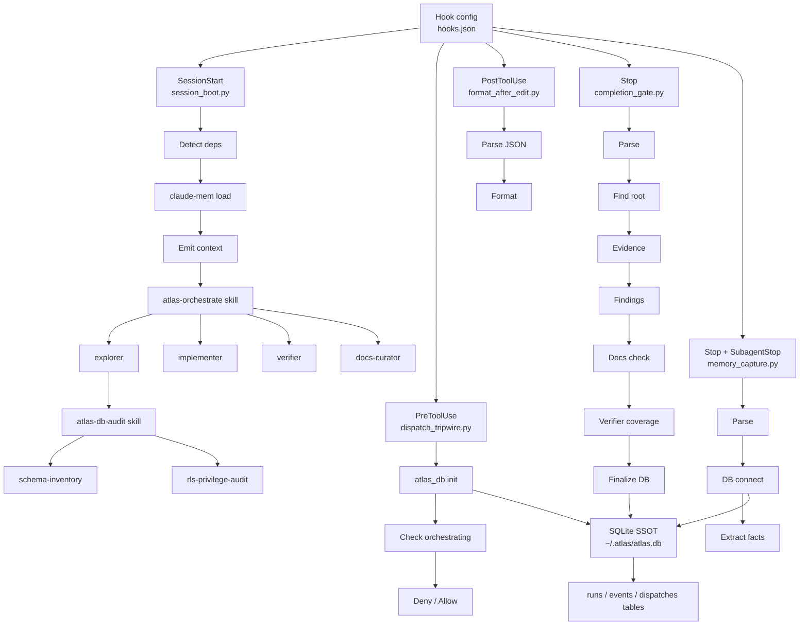

# Atlas Plugin Architecture Map - 2026-07-17

Produced by `atlas-audit architecture`. Three read-only explorers (orchestration engine, repo boundaries, MCP servers) mapped the tree; this is the synthesis. Input for the graphify wiki pipeline (`docs/architecture/` -> `docs/wiki/diagrams/`).

## Orchestration engine (hook -> DB -> subagent flow)

Key facts:
- SQLite SSOT schema at `atlas_db.py:11-86`; DB at `~/.atlas/atlas.db` (or `$ATLAS_DB`). Tables: `runs`, `events`, `dispatches`.
- Skills wire to agents by agent-type name in SKILL.md (e.g. atlas-db-audit -> schema-inventory / rls-privilege-audit / explorer).
- `session_boot` is fail-open throughout (any error exits 0). `completion_gate` is fail-closed on verifier/git checks but fail-open on structure checks. (The CODE audit flags several fail-open branches as contradicting their own comments.)
- Updated 2026-07-28 (atlas 5.2.0): the per-hook Stop-loop guard described in an earlier revision of this note was superseded the same day by a shared module, `plugins/atlas/scripts/atlas_hook_guard.py` (`read_payload()`, `should_run()`, `emit()`, per-session state at `~/.atlas/hookstate/<session_id>.json`). All five Stop hooks (`completion_gate`, `ingest_session`, `memory_capture`, `auto_skill`, `nudge`) now route through it instead of each hand-implementing its own `stop_hook_active` check and dedupe. The module adds a session-wide circuit breaker (`STOP_BURST_LIMIT = 5` Stop events per `STOP_BURST_WINDOW = 120` seconds trips it for the rest of the session, silencing every atlas Stop hook) that no per-hook throttle could provide on its own. `completion_gate.py` deliberately calls `should_run()` only, not `emit()`, so its repeat-until-fixed definition-of-done message is not deduped away; only the breaker can silence it. `memory_capture.py` separately keeps its own fact-level seen-marker (`~/.atlas/.memory_capture_seen`), which tracks facts rather than messages and is unrelated to the guard module. See `.atlas/findings/2026-07-28-stop-hook-memory-capture-loop.md`.
- Updated 2026-08-05: `should_run()` gained a `kind="capture"|"emit"` parameter (`atlas_hook_guard.py:140-159`) because the unconditional `stop_hook_active` short-circuit above was found to also silence the three capture-only hooks (`ingest_session`, `memory_capture`, and the new `chronicle_facet`, all now `kind="capture"`) on every completion_gate block -- the direct cause of a self-improvement telemetry stall. Only `kind="emit"` hooks (`nudge`, `auto_skill`, `completion_gate`) are still gated by `stop_hook_active`; the circuit breaker and per-hook throttle apply to both kinds unchanged. New Stop hook `chronicle_facet.py` writes one deterministic `facets` row per session plus mirrors `signals` into the new `friction_events` table, wired in `hooks.json` after `ingest_session.py`, before `memory_capture.py`. `completion_gate.py` conditions (f)/(g) rescoped from the whole git working tree to only this run's own written paths. See `docs/CHANGELOG.md` 2026-08-05 and `.atlas/findings/2026-08-05-stop-hook-active-silenced-capture-hooks.md`.
- Updated 2026-08-06: `completion_gate.py`'s condition (f) only fires at Stop -- often many edits after the code drifted from docs/. `_find_root`, `_docs_drift`, and `_git_changed_paths` (the `Root-finding` duplication row below) were extracted out of `completion_gate.py` into a new shared module, `plugins/atlas/hooks/docs_drift.py` (public names `find_root`, `docs_drift`, `git_changed_paths`; `completion_gate.py` imports and aliases them back to their old underscored names so its existing tests are unchanged). A new PostToolUse hook, `docs_drift_watch.py`, imports the same module and warns inline the moment an Edit/Write/MultiEdit drifts code from docs/, instead of waiting for Stop. It is debounced: warns on the first drifting edit, then every 5th one after, and resets the moment docs/ reappears in the diff. Stop's condition (f) remains the backstop, unchanged in behavior.
- Updated 2026-08-06 (fix): the debounce counter in `.atlas/.run/docs_drift_watch.json` is now session-scoped, not merely repo-scoped -- an independent verifier found that a fresh session inherited the prior session's streak and could stay silent through its first drifting edits, breaking the "first drifting edit always warns" guarantee. The state file now records the `session_id` from the PostToolUse payload; a differing or absent `session_id` resets the streak to 0 before it increments, so a new session (or a payload missing `session_id`) always warns on its first drifting edit. The same fix pass also addressed a performance defect: the hook's `git diff`/`git rev-parse` calls ran on every qualifying edit regardless of streak (measured ~38ms avg / 46ms max per edit on a near-empty repo). The git result is now cached in the same state file, keyed on `time.monotonic()`, and reused for `GIT_CACHE_TTL_SECONDS` (2 seconds, no config knob) -- re-measured at ~21ms avg / ~34ms max per edit on the same kind of repo. This trades up to 2 seconds of staleness in the reported non-docs file count for the avoided subprocess calls; the boolean drift/no-drift outcome is unaffected in the common case because a burst of same-direction edits (all non-docs, or all docs) doesn't change that outcome mid-burst. State writes also moved from a bare `write_text` to a temp-file-plus-`os.replace` (atomic on POSIX), so a crash mid-write can no longer corrupt the state file; a lost increment under concurrent invocations remains an accepted, fail-open tradeoff. See `.atlas/.run/findings.json` (status `needs-verification`) for the verifier's original three findings and this fix's evidence.
- Updated 2026-08-06 (Stop-hook noise fix, 3 defects): (1) `completion_gate.py` conditions (a) evidence and (b) verified-finding are now scoped to the same `_nondocs_changed` run-write signal already used by (f)/(g) -- a run that shipped zero non-docs code (a question answered, a read-only audit) is no longer blocked into manufacturing a findings.json entry to satisfy an inapplicable gate. (2) The gate no longer emits an `additionalContext` narration ("this run wrote zero non-docs files...") on every passing Stop -- it fired on every turn of a long session and invited a reply; the gate is now silent on any pass and speaks only when it blocks. (3) `nudge.py` was removed from the `SubagentStop` binding in `hooks.json` (Stop only now): its self-improvement prompt landed in a dispatched subagent's context immediately before it composed its final response, and the subagent would answer the nudge instead of returning its deliverable, costing a resume round trip. `ingest_session.py` was confirmed to emit nothing into the model's context on `SubagentStop` (silent capture, as documented). `memory_capture.py`, however, was found to still emit an `additionalContext` summary on `SubagentStop` (and `Stop`) reporting what it captured -- this is a real, unresolved instance of the same class of noise this fix targeted for `nudge.py`, left in place per explicit scope (out of scope for this fix; flagged for a follow-up). See `docs/CHANGELOG.md` 2026-08-06.

## Repo feature boundaries

- **Root `/skills/` (12 standalone tools):** az-cost-optimize, azure-deployment-preflight, cloud-design-patterns, codebase-brain, database-optimization, entra-agent-user, graphify, msgraph-sdk, msoffice-docs, scrapling-official, security-audit, webapp-testing. All target external domains (Azure, MS APIs, security, web).
- **`/plugins/atlas/` (the plugin):** 21 atlas-* skills + 12 agents + 13 hooks + scripts. Atlas-specific operations (audit, debug, orchestrate).
  <!-- 2026-08-06: hooks 12 -> 13 with the addition of docs_drift_watch.py
       (PostToolUse inline docs-drift warning; backstop for completion_gate's
       Stop-time condition f). docs_drift.py is a shared helper module the
       two hooks import from, not a hook itself, so it is not in this count.
       Count is the 12 scripts wired in hooks/hooks.json plus
       atlas_doctor.py --hook on SessionStart. -->
- **`/plugins/armada/` (org config layer):** 11 department agents carrying org branding/compliance context + the armada routing skill.
- **`/plugins/programmer/` (independent developer-tools plugin, added 2026-07-21):** 2 skills (tpp-audit, tpp-principles) + 1 agent (tpp-auditor) + 1 UserPromptSubmit hook. Pragmatic Programmer codebase auditor with an 89-concept glossary; not part of the atlas orchestration engine.
- **`/plugins/_standards/`, `/plugins/_templates/`:** scaffolding docs and skill/command/agent/plugin templates.
- **`/mcp_servers/`:** per-vendor MCP servers (auvik, cipp, connectwise-manage, vanta, knowbe4, ...).

## Duplication findings (candidates for unification)

| Concern | Sites | Note |
|---|---|---|
| JSON-stdin parse boilerplate | 8 hooks: bash_advisor, completion_gate, dispatch_tripwire, format_after_edit, ingest_session, memory_capture, nudge, prompt_optimizer | Identical `stdin.read()` -> `json.loads or {}` -> `except: return 0`. Extract one `read_hook_input()` helper. |
| Root-finding (walk up to `docs/`) | `docs_drift.py` (`find_root`, shared by `completion_gate.py` and `docs_drift_watch.py` since 2026-08-06), `session_boot.py:164-180` | The `completion_gate.py`/`docs_drift_watch.py` copy is unified; `session_boot.py`'s inline `find_structure` walk is untouched and still a separate implementation. |
| atlas_db bootstrap (sys.path + connect + init) | `dispatch_tripwire.py:122-134`, `completion_gate.py:390-408`, `memory_capture.py:216` | No shared bootstrap; each hook re-injects `scripts/` on sys.path and re-inits. One `atlas_db.bootstrap()` would centralize it. |
| MCP-server shell / `DomainHandler` interface | copied per server, `vanta` vs `knowbe4` have DRIFTED | The whole MCP-server shell is duplicated and the copies diverge. Highest-risk duplication: drift means per-server behavior differences. Candidate for a shared `mcp_servers/_shared` (note: that dir was just deleted in `56d1a9f`, breaking auvik - see CODE audit H7; the unification target must be rebuilt, not assumed present). |

M365 coverage duplication (previously `armada/agents/armada-m365.md` vs `atlas/skills/atlas-m365/SKILL.md`) is resolved: `atlas-m365` was deleted 2026-07-21 (see docs/CHANGELOG.md), leaving `armada-m365.md` as the sole M365 coverage.

## Simplest unification proposal

1. **One `hooklib.py` in `plugins/atlas/hooks/`** exporting `read_hook_input()`, `find_repo_root()`, and `db_bootstrap()`. Collapses the top three duplication rows across all hooks; smallest diff with the largest dedup.
2. **Rebuild a single MCP `_shared`** (error-envelope, base-url, response-shaper, DomainHandler) and repoint every server at it, reconciling the vanta/knowbe4 drift to one definition. This also fixes CODE-audit H7 (auvik dangling import). Do these together.
3. Leave the root-skills / atlas-plugin / armada three-layer split as-is - it is a real boundary (external tools vs atlas ops vs org governance), not accidental duplication.
