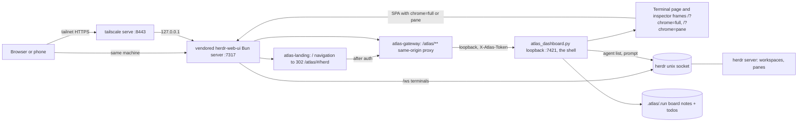
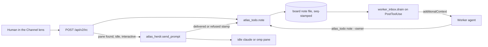

# Atlas Colony (herdr)

Last verified against the source on 2026-10-08 (atlas 10.4.0). The colony is the set of worker agents an orchestrator spawns as live terminal panes you can watch and talk to from a browser or phone. It runs on [herdr](https://github.com/herdrdev/herdr) (terminal multiplexer, installed binary) with the vendored [herdr-web-ui](https://github.com/devswha/herdr-web-ui) (MIT, `colony/herdr-web-ui`) as the single browser front door. The **Atlas Command Center is the shell**: a browser that opens the front door lands on it, and it hosts the herdr-web-ui app as its **Terminal** page (`#/terminal`, `?chrome=full`, edge to edge) and in the inspector's Terminal tab (`?chrome=pane`). Its **Colony** page (`#/colony`) is the roster of this project's lead and registered workers (see Colony roster below). tmux is only the explicit fallback.

> **Updating the plugin.** The running omp and Claude Code sessions load the **installed plugin cache** (omp: `~/.omp/plugins/cache/...`, Claude Code: `~/.claude/plugins/cache/...`), not this repository. Fixes made here (the omp worker `--thinking` fix in `scripts/atlas_mux.py`, the channel registration for dispatches and workers, the Colony page) reach a live session only after the plugin is committed, released and reinstalled or updated from this marketplace repo. The one exception is the dashboard daemon on `127.0.0.1:7421`: it serves this repo's `scripts/dashboard_ui/` files directly, so the Colony page and the other UI changes are live there without a plugin update (a browser reload picks them up). Until the update, a session on an older cache keeps its old behaviour, for example an empty channel list ("No colony is running" / "No members yet") because that cache has no channel registration.

Paths below are relative to `plugins/atlas/` unless they start with `docs/`.

## Architecture



- **Request flow.** The browser reaches the herdr-web-ui Bun server (directly on loopback, or through `tailscale serve :8443`). herdr-web-ui's own access decision (`decideAccess`) runs first and is final. A plain browser navigation of `/` (GET/HEAD, `Accept: text/html`, no `embed`, `pane`, `machine` or `chrome` query, `Sec-Fetch-Dest` absent or `document`, full access) is answered `302 /atlas/#/herd` (`server/atlas-landing.ts:atlasLandingRedirect`; the Command Center router redirects `#/herd` to `#/terminal`); an unauthenticated request never gets the redirect and keeps the normal pairing/AccessGate flow. `/atlas/**` is relayed by `server/atlas-gateway.ts` to the dashboard on loopback; when the dashboard is down a navigation gets an HTML "unreachable" page (status 502) and an API caller gets JSON 502 `atlas_dashboard_unreachable`.
- **The Atlas Command Center is the only nav.** Its groups are Observe, Operate, Improve, Configure (`scripts/dashboard_ui/js/app.js` `GROUPS`); Operate holds **Agents** (the page's Fleet | Board | Supervision lens bar; `js/pages/agents.js`), **Colony** (`#/colony`, chord `g c`, `js/pages/colony.js`, the roster), **Channels** (`#/channels`, chord `g n`, `js/pages/channels.js`) and a live tree of herdr workspaces, tabs and agents. The herdr-web-ui app is the **Terminal** page (`#/terminal`, `js/pages/herdr.js`; reached from the Colony page's "Open terminal (herdr)" button and from Fleet "Open in Colony"), framed edge to edge: no page header, no lens bar and no second view. The Fleet inspector's Terminal tab frames one pane as `?chrome=pane`. The old routes `#/herd`, `#/herdr`, `#/console` and `#/agents?lens=console` or `lens=colony` redirect to `#/terminal`; `#/irc`, `#/channel` and `#/agents?lens=channel` redirect to `#/channels`; `#/work` redirects to the Board lens (`ALIASES` and the lens redirect in `route()` in `app.js`; saved nav orders are mapped the same way by `NAV_ALIASES` in `js/nav-order.js`). On mobile the bottom bar and its More menu carry `Colony` and `Channels` entries (`MOBILE_TABS`). Framed inside the Command Center, the herdr-web-ui app shows no Atlas navigation, header chip or dashboard iframe. Product overview: `docs/atlas-workboard.md`.
- **How the herdr UI is embedded.** One builder, `mountConsoleFrame(ctx, body)` exported from `scripts/dashboard_ui/js/pages/herdr.js`, creates the iframe; the Terminal page (`#/terminal[?pane=<id>]`) is a single `div.page.terminal-page` that holds only that frame. It frames `<origin>/?chrome=full&theme=<t>` (`consoleUrl` in `js/fleet.js`, which adds `pane=<id>&machine=local` when a pane is given; sandbox `allow-scripts allow-same-origin allow-forms allow-popups allow-popups-to-escape-sandbox allow-downloads`, `allow="clipboard-read; clipboard-write; microphone; fullscreen"`); the inspector's Terminal tab (`js/fleet.js` `paneUrl`) frames `/?pane=<id>&machine=local&chrome=pane&theme=<t>`. Under `/atlas/` (`<meta name="atlas-base">` present) both use `location.origin`; standalone they use the URL `GET /api/v2/herd/console` reports (`url`, `chrome_full_url`, `herdr_ui_url`, `pane_url_template`, `reachable`, `auth_required`, `layers`). Frame states, drawn from the agents store layers (the frame is a separate origin and is never read): loading while the store loads; the "herdr isn't running" card (**Recheck**) when herdr is down; the terminal-service card ("The terminal service isn't running. The agent list is live; terminals need it.") with a **Start terminal service** button (`POST /api/v2/herd/ensure`, toast "Terminal service started", then a recheck) and **Recheck** when herdr runs but its web UI does not; and a "The terminal is slow to load" card with a retry once the iframe has not fired `load` after 12 s. `draw()` only creates a new iframe when the target URL changes, so store ticks and SSE events never reload it. The pane the frame itself reports (`herdr:selected-pane`) is recorded by `noteFramePane(pane)` (exported from `herdr.js`, called from the `app.js` message handler, which then sets `?pane=`), so the frame node and `src` stay stable; a pane that arrives from outside (deep link, Fleet "Open in Colony", route change) still rebuilds the frame. Recursion guard: when the dashboard is itself framed (`window.self !== window.top`, e.g. inside the herdr app) no frame is built and the card says "The terminal cannot open inside itself". A notification click or a pane selection reported by the frame navigates to `#/terminal?pane=<id>` (`app.js`). The earlier Colony page iframe on `/?embed=1` is retired; `?embed=1` survives only as a legacy URL that the host rewrites (next bullet).
- **Host modes (`colony/herdr-web-ui`).** `?chrome=pane` (what the inspector's Terminal tab frames) renders only a `.pane-strip` title plus the pane's terminal/chat, honours `?theme=` and does not overwrite the stored pane selection. `?chrome=full` (`CHROME_FULL` in `src/App.tsx`, `isChromeFull` in `src/lib/atlasBridge.ts`) only takes effect when the page is framed (`window.self !== window.top`): it then drops the header, the sidebar toggle, the workspace drawer and the scrim (the pane list lives in the dashboard) and shows a slim pane strip with the Chat/Terminal switch; tabs, dialogs, files and shortcuts stay. A top-level `?chrome=full` visit shows the normal herdr UI. The legacy `?embed=1` is retired: `retireEmbedParam` rewrites it in place (no reload) to `?chrome=pane` when `pane=` is given and to `?chrome=full` otherwise. In any framed mode other than `chrome=pane` the header Sign out, the palette Sign out and the Revoke button on the current device in Settings are hidden, because the cookie is shared with the Atlas shell. The framed host posts `herdr:selected-pane {pane_id, machine_id}` and `herdr:attention {count}` to its parent (target origin = its own origin) and accepts `atlas:theme {theme}` and `atlas:select-pane {pane_id, machine_id?}` only from the same-origin parent window. The service worker (`public/sw.js`, cache `herdr-web-ui-v6-ram`, every older cache is deleted at activate) never handles `/atlas` navigations; a notification click prefers a top-level herdr page and otherwise opens `/atlas/#/herdr?pane=<id>`. Workspace, tab and pane actions from the Command Center use the host's same-origin `/api/workspace|tab|pane/*` routes with the shared cookie; the host's own role checks and same-origin requirement for mutations apply, and a watch device cannot mutate.
- **One chrome layer inside the frame (`?chrome=full`).** herdr's own plugin panes (`Sidebar`: the file explorer and git viewer, told apart by the `herdr-sidebar-*` tokens or the label `Sidebar` and no agent, `isSidebarPane` in `src/lib/dagPane.ts`) are never listed or opened in the frame, so the first paint is an agent's chat/terminal, never the file tree of `~/.config/herdr`. With no usable pane the frame selects, in order, the working agent, any agent, any other pane (`colonyFallbackPane`), including over a stored selection that was a sidebar pane; with none it shows "No agents running. Start one from Agents." There is exactly one slim `.pane-strip.pane-strip-colony` row: the workspace's tabs (`TabStrip`, only when the workspace has two or more usable panes; it is the only way to switch panes in the frame) or the pane title, then the connection dot and the Chat/Terminal switch. The second tab row under the strip, the toolbar and the leaked `Sidebar` label are gone. The frame marks `<html data-chrome="full">`; on a phone the terminal key bar (Esc, Tab, Ctrl, arrows) is hidden until the soft keyboard is up (`html[data-keyboard]`, set by `src/lib/viewport.ts`), so it never stacks on the Atlas bottom tab bar. Vendored patches are listed in `colony/herdr-web-ui/UPSTREAM.md`.
- Workers are panes of a herdr workspace named `atlas-<run>`; the first worker of a run creates the workspace, each later worker gets its own tab (`scripts/atlas_herdr.py:create_pane`).

## Spawning workers (transport)

`scripts/atlas_mux.py:transport()` returns `herdr` unless `ATLAS_COLONY_TRANSPORT=tmux` or the herdr socket does not answer (`atlas_herdr._server_up`), in which case it returns `tmux`.

| Layer | What it does | Source |
|---|---|---|
| `atlas_launch.launch(root, name, prompt, ...)` | Starts one detached worker pane (interactive `omp --cwd <cwd> @<prompt_file>`, or a headless `atlas_mux spawn`). Never attaches or focuses. `attach` is the web UI URL for a herdr pane, `tmux attach -t <target>` otherwise. | `scripts/atlas_launch.py:1-12`, `:226-235` |
| `atlas_mux.py spawn \| status \| kill \| run-worker` | Headless tiered workers (`claude -p`, `omp -p`). `status` and `kill` follow `transport()`; `kill` on herdr closes the run's workspace and writes `exit 137 [failed: killed by atlas_mux kill]` for any worker without its own exit note. | `scripts/atlas_mux.py:1-40`, `cmd_status`, `cmd_kill` |
| `atlas_herdr.create_pane` | `workspace.create` / `tab.create`, `pane.rename`, then `pane.send_input` with the command plus `enter`. Refuses a duplicate worker name in the same run. | `scripts/atlas_herdr.py:create_pane` |
| `atlas_mux.pane_env` / `pane_command` | Pins `ATLAS_PROJECT_ROOT` and `ATLAS_WORKER_NAME` plus the allow-listed lead env (`FORWARDED_ENV`) on the pane, and wraps the command as `exec env K=V ... argv` so a shell that resets its env cannot drop the pins. | `scripts/atlas_mux.py:72` (`FORWARDED_ENV`), `:161-171` |

`ATLAS_MUX=tmux` remains the opt-in gate for `atlas_mux.py spawn` even on the herdr transport (`scripts/atlas_mux.py:_validate`); `atlas_launch` forces it in the child env only (`scripts/atlas_launch.py:68`).

## Board, notes and IRC

The board (`<project>/.atlas/.run/`) is the durable channel; `scripts/atlas_todo.py` is its single writer.



- Every message is a board note written by `atlas_todo.note(root, sender, body, to=..., delivery=...)` (`scripts/atlas_todo.py:744`). `GET/POST /api/v2/irc` live in `scripts/atlas_dash_irc.py`; todos in `scripts/atlas_dash_work.py` (`GET/POST /api/v2/todos`).
- **Channel registration (who is in a channel).** Channels are `<folder>@<branch>` (`@<short-sha>` on a detached HEAD, the folder name outside git) and a lead subchannel `<main>/<lead>`; the full model is in `docs/atlas-channels.md`. Membership is granted lead-side only, in three ways: an omp `task` dispatch (`omp/channels.ts` `reviseForChannel` runs `atlas_todo.py channel-open`), a Claude Code `Task`/`Agent` dispatch (`hooks/dispatch_tripwire.py` `_channel_dispatch`), and a mux or launch worker (`atlas_launch.launch` and `atlas_mux spawn` register the worker before it starts, with the lead name from the channel registry entry). A worker never registers itself; a worker started outside those paths is not registered and its notes land on the main channel. A dispatch also creates one todo owned by each named member on the lead channel (`dispatch_tripwire` for `atlas:*` dispatches, `reviseForChannel` for any named agent except the generic `task`). `channel-open --root` canonicalizes the root (`find_root`), so a dispatch from a subdirectory lands in the project's own registry. A note posted by owner `lead` (omp's main thread) with no channel goes to the newest lead subchannel (`default_channel`), and `channel_board` groups the lead's own plan items (unowned todos of that session) under the lead member. A failure of `channel-open` or of the dispatch hook is recorded as a fault (`hook-faults.jsonl`, hook `channels` for omp, `dispatch_tripwire` for Claude Code) instead of a stderr message, and the dispatch still proceeds. The registry lock wait is bounded to 2 s (`atlas_todo.CHANNEL_LOCK_TIMEOUT_S`): a timeout is recorded as `atlas_todo.register_worker.lock_timeout` (launch/mux registration) or `dispatch_tripwire.channel_lock_timeout` (Claude Code dispatch) and the dispatch proceeds without channel registration. `ATLAS_CHANNELS=off` disables the automatic wiring on both harnesses.
- **omp worker thinking level.** `atlas_mux.py` reads each agent definition's frontmatter (`_frontmatter`) and launches `omp -p --model=<m> --thinking=<level>`. The generated `omp/agents/*.md` quote scalars (`thinkingLevel: "medium"`); `_frontmatter` strips one matched pair of surrounding quotes, so omp receives `--thinking=medium`, not `--thinking="medium"` (which omp rejects with exit 2). `scripts/test_atlas_mux.py` runs this against all 13 shipped agent files.
- **Pane delivery (`atlas_dash_irc._deliver`).** For a message to a named agent, the dashboard looks for a herdr agent whose pane id, tab title or workspace label equals the name. If it is an interactive `claude` or `omp` agent and idle, `atlas_herdr.send_prompt` types `From: <sender> | To: <to> | <text>` (control characters collapsed to spaces) and the note is stamped `delivery=delivered`. A pane running anything else is stamped `refused` and answered `409 pane_not_steerable` without typing. A busy or unreachable herdr stamps nothing: the note stays `queued` and answers `agent_busy` (409) or `herdr_refused`.
- **Hook delivery.** A worker pane carries `ATLAS_WORKER_NAME` + `ATLAS_PROJECT_ROOT`; on each PostToolUse `hooks/worker_inbox.py:drain` returns notes addressed to it since its cursor (`<root>/.atlas/.run/inbox/<worker>.json` = `{ts, seq}`, at most 10 notes, 600 chars each; the cursor never moves backwards) and advances the cursor, so each note is delivered once. Notes already stamped `delivered` or `refused` are never drained, so a typed message is not injected twice. A lead receives only notes of its own channels from members (rules in `docs/atlas-channels.md`).
- **Worker output.** A headless mux worker does not post its stdout to the board: it posts one `kind=report` note (its `STATUS`..end block, else its last 20 non-noise lines, then `exit N`), writes everything to `<project>/.atlas/.run/logs/<worker>.log`, is marked finished in the registry (`exit_code`, `ended_at`) and leaves the channel.
- **Delivery states** reported by `GET /api/v2/irc`: `queued`, `read`, `delivered`, `refused`, `undeliverable` (nothing drained it within `QUEUED_TTL_S`) (`atlas_dash_irc._delivery_status`).
- `send_prompt` itself (`scripts/atlas_herdr.py:send_prompt`): text required and at most 8000 characters; the pane id must be in the live agent list; the agent must be `idle` (409 otherwise); herdr socket errors map to 503/502.

### Colony roster (`#/colony`)

`scripts/atlas_dash_colony.py` (mounted through `atlas_dash_herd.ROUTES`; page `js/pages/colony.js`) lists the lead and the workers registered in ONE project's channel registry, each with the todos it owns, its last note, its state and Send/Kill. A "Show all herdr panes" checkbox (`all=1`) widens the list to every herdr agent pane; "Open terminal (herdr)" opens `#/terminal`.

| Route | Use |
|---|---|
| `GET /api/v2/colony?project=<abs root>[&all=1]` | `{ok, project, lead: {name, channel}, members[], herdr_url}`; each member has `name`, `kind`, `state`, `pane_id`, `steerable`, `headless`, `channel`, `tasks[]` (`id`, `title`, raw `pending`/`in_progress`/`completed` status), `last_note {ts, text}`, `log_path`, `exit_code`, `ended_at`. 400 `project_required` without `project` |
| `POST /api/v2/colony/<name>/send {text, project}` | A steerable idle pane gets the text typed into it (`{delivered: true}`); otherwise it is queued as a board note to that member (`{queued: true}`). 400 `project_required`, 400 `text_required`, 404 `no_such_member`, 409 `member_finished` or `member_dead` (nothing would read it) |
| `POST /api/v2/colony/<name>/kill {project}` | Closes the member's own recorded pane (`pane_id`), else SIGTERMs its own recorded harness pid only when that pid is alive and its recorded `pid_start` matches the process start time. A member with neither is 409 `member_dead`. 400 `project_required`, 404 `no_such_member`, 409 `lead_not_killable` (the lead is the user's own session), 409 `member_finished` / `member_dead`, 409 `kill_failed` |

States (`_state`): `finished` (exit 0 recorded), `dead` (nonzero exit recorded; or a worker with no live pane or pid whose recorded pid is gone or whose log has not changed for 15 minutes), `stuck` (live, or with no liveness signal at all, silent for 15 minutes with an open todo), `idle` (live pane idle; a lead that is not live and quiet) and `running`. A member with no pane and no pid (an in-process omp `task` subagent) is `running` while it has recent activity (a note, a todo update or its join).

**Member handles.** A member's pane and process are the ones recorded on its own registry entry (`atlas_todo.set_member_handles`): `atlas_mux spawn` and `atlas_launch` (interactive herdr pane) record `pane_id` when the pane is created, and `atlas_mux run-worker` records its harness child `pid` right after starting it, with its start time (`pid_start`, from `ps lstart`). A pid counts as the member's only when alive and the start time matches; a recycled or start-less pid is `dead` and Kill is 409 `member_dead` without signalling (start time has 1 s resolution, so same-second reuse would match). The roster never matches a pane by bare label, so the same member name live in another project is never this member's pane; a member with no recorded handle has no pane, cannot be killed, and (for a headless worker) is `dead` once its recorded pid is gone. Registering a name again (`register_member`, a retry or respawn) clears the old `exit_code`, `ended_at`, `pid` and `pane_id`, so the new run is live. A spawn that fails to open its window unregisters the member again.

## Install and single instance

### herdr (the multiplexer binary)

herdr is an installed binary, not vendored. Atlas pins a minimum version in `colony/herdr/PIN.json` (`version`, `sha`, `min_protocol`, `install_url`); `python3 plugins/atlas/scripts/atlas_herdr.py install-check` is read-only and fails with `why` + `do` when herdr is missing or older than the pin. Install it from https://herdr.dev and run `herdr` in a terminal. Atlas cannot start herdr itself.

### herdr-web-ui (the vendored colony build)

herdr-web-ui is vendored at `colony/herdr-web-ui` (MIT, upstream `devswha/herdr-web-ui`, pinned version and sha in `colony/herdr-web-ui/UPSTREAM.md`). It is not byte-identical to upstream: `UPSTREAM.md` lists every atlas patch under `ATLAS-PATCHES`. Server side: the new `server/atlas-gateway.ts` (`/atlas/**` same-origin proxy) and `server/atlas-landing.ts` (root redirect), wired into `server/index.ts`. App side: the new `src/lib/atlasBridge.ts` (`FRAMED`, `retireEmbedParam`, `isChromeFull`, `postToParent`, `onParentMessage`), `src/App.tsx` (`chrome=pane` and `chrome=full` modes, the parent bridge, Sign out hidden when framed), `src/lib/settings.ts` (`?theme=` pin, `atlas:theme`), `src/components/DevicesPanel.tsx` (no Revoke for the current device when framed), `src/styles.css` (`.pane-strip`), `public/sw.js` (cache `v6`) and the follow-up tests `src/pwa.test.ts` and `src/pwa-notification.test.ts`. Framing needed no patch: upstream sends no `X-Frame-Options` or `frame-ancestors`.

The vendored tree is never written to or run in place. The first `atlas_herdr.py ensure` mirrors it to `$ATLAS_HOME/colony/herdr-web-ui` (`rsync`), runs `bun install --frozen-lockfile` and `bun run build` there (redone when anything in the vendored tree changes: the `.atlas-build` stamp hashes the whole tree except `node_modules`, `dist`, `.git` and `evidence`), then starts it with `bun scripts/plugin.ts start` (it binds `127.0.0.1:7317` when that port is free; see Single instance for the fallback). `atlas_herdr.py ensure` also rebuilds and restarts the vendored server when the mirror is stale (stamp of the whole vendored tree): it builds first, then stops and starts only the vendored instance (`action: restarted`, `reason: stale_mirror`); a failed build leaves the running server untouched.

### Single instance

There is only ever one vendored colony web UI. `atlas_herdr.ensure()` returns `reused` when the vendored build already answers, waits (20 s) when a `managed.ts` process exists but is not healthy (never a second spawn), and otherwise builds and starts under an exclusive `flock` on `$ATLAS_HOME/herdr-web.lock`. The vendored build is told apart from a user-run upstream herdr-web-ui because only it answers `/atlas/api/health` with JSON (`atlas_herdr._is_vendored`).

Default port is 7317 (`DEFAULT_PORT`). `atlas_herdr.ensure()` binds the vendored build there when nothing else holds it. When a user-run upstream herdr-web-ui already holds 7317 (`_probe` tells it from the vendored build by the JSON `/atlas/api/health`), Atlas never touches that instance: `_where()` looks for the colony on the fallback ports and, if none runs, `ensure` starts the vendored build on the first free fallback port (`_free_port`: 17317, 27317, 37317, 47317) with its own state dir (`$ATLAS_HOME/colony/state`) and records it in `$ATLAS_HOME/colony/port` (absent while the vendored build owns 7317). `status()` and the `ensure` result then carry `upstream_plugin_on_port: true`, `upstream_url` and `takeover`, the commands the user can run to let the vendored build own 7317 (`takeover_hint`, never run by Atlas). **Order matters** (verified on 2026-10-07): stop the running upstream instance FIRST while its plugin is still enabled, then disable it, then start the vendored build: (1) `herdr plugin action invoke stop --plugin devswha.herdr-web-ui`, (2) `herdr plugin disable devswha.herdr-web-ui`, (3) `rm -f $ATLAS_HOME/colony/port`, (4) `python3 plugins/atlas/scripts/atlas_herdr.py ensure`, (5) `python3 plugins/atlas/scripts/atlas_remote.py apply --yes --replace` to re-point the tailscale mapping. Disabling first makes the `stop` action fail (`plugin_disabled`) and leaves the server running. NOTE: `takeover_hint()` in `scripts/atlas_herdr.py` still prints the disable step before the stop step; follow the order above until the code is aligned. If every fallback port is busy `ensure` answers unavailable. `status()` also reports `duplicates` (extra `managed.ts` processes); `atlas_herdr.py reap` terminates duplicate `managed.ts` trees of the colony, keeping the oldest. This page does not state what currently runs on any port on a given machine; run `atlas_herdr.py status` for that.

Takeover verified on the author machine (2026-10-07, 05:49 run, following the order above): the vendored build was then the sole listener on 7317; `/atlas/api/health` returned the dashboard JSON both locally and over `https://<node>.<tailnet>.ts.net:8443`; a browser navigation of `/` was redirected to `/atlas/#/herd` (the router has since changed that alias to `#/terminal`); and a forwarded request without credentials got `pairing_required`. This is a dated record of the procedure working, not a statement of what any machine runs now: run `atlas_herdr.py status`.

**Open item (stack ownership, as last observed).** On 2026-10-07 the one listener on 7317 (`lsof -iTCP:7317`) was the **vendored** copy under `~/.atlas/colony/herdr-web-ui`: the process chain was `server/managed.ts` -> `server/supervisor.ts` -> `server/index.ts` run from that directory, and `atlas_herdr.py status` reported `vendored_running: true`, `upstream_plugin_on_port: false`, `plugin_root: ~/.atlas/colony/herdr-web-ui`. That copy is started by `atlas_herdr.py ensure`, not the upstream plugin directory, while the user's stated choice is the upstream plugin only. Exactly one stack ran and the fallback ports (17317, 27317, 37317, 47317) were free, so nothing is duplicated. Whether `atlas_herdr.py` should keep starting the vendored copy is a decision for the owner of `atlas_herdr.py`; this doc does not change that behavior.

### CLI

```
python3 plugins/atlas/scripts/atlas_herdr.py status|ensure|reap|install-check
python3 plugins/atlas/scripts/atlas_herdr.py create-pane --name N [--cwd D] [--run R] [--env K=V ...] -- <command...>
```

All verbs print JSON. `status` never spawns and is cached for 2 s; its `state` is `ok`, `server_down` (herdr not running) or `web_ui_down`, and it carries `url` / `colony_url` (the colony web UI base URL the Terminal page and inspector frame).

### Session start

`hooks/session_boot.py:ensure_colony` (called after the dashboard ensure, fail-open) reads a cached `atlas_herdr.py status` (`$ATLAS_HOME/herdr-status-cache.json`). A healthy answer is trusted for 10 min and refreshed detached after 30 s (stale-while-revalidate). An unhealthy answer is reused for 60 s: if herdr itself is not running, boot skips the probe entirely; otherwise `atlas_herdr.py ensure` starts detached under the same lock (output in `$ATLAS_HOME/herdr-ensure.log`), so a second instance is never started. With a **cold cache** (no or unreadable file) boot never pays the status probe: it starts the probe detached and prints `colony: checking`; the next boot uses the cached result. It does nothing when herdr itself is not running. `ATLAS_COLONY=off` (also `0`, `false`, `no`) disables it.

**Existing-stack guard (`_colony_stack_url`).** Boot never spawns a second herdr-web-ui stack. When the cached status says the web UI is down but herdr is up, `ensure_colony` first calls `_colony_stack_url(data)`, which is read-only: (1) `GET /api/health` with a 300 ms timeout on the status `url` first, then `http://127.0.0.1:<p>` for 7317, 17317, 27317, 37317 and 47317; the first that answers HTTP 200 is the stack. (2) If none answers and the cached status has `upstream_plugin_on_port`, a stack exists but no port is known. (3) Otherwise one `ps -axo command` snapshot (2 s timeout) is matched against `server/(managed|supervisor).ts`, `bun [<path>/]server/index.ts` and `herdr-web-ui.../server/index.ts`; a match also means "a stack exists, port unknown". Any non-empty finding means nothing is started: boot prints `colony: <url> (ready)` for a URL that answered, or `colony: herdr web UI running (port unknown)`. Only when no stack is found, herdr is running and the cache is not cold does boot start one detached `atlas_herdr.py ensure` (flock-guarded, output in `herdr-ensure.log`) and print `colony: starting the herdr web UI at <url> (log: <path>)`. herdr down -> nothing; cold cache -> a detached status refresh and `colony: checking`; an unhealthy cached status is reused for 60 s (`_COLONY_DOWN_TTL_S`); a healthy one prints `colony ready at <url>`. Known limit: the `ps` match is on the command line only, so a stack that answers on none of the five ports and whose command line carries none of those strings is not seen. Covered by `hooks/test_session_boot_colony.py` (`test_no_stack_and_herdr_up_one_guarded_ensure` expects exactly one ensure; the ps, upstream-flag and health-listener cases assert none).

## Security model

The web UI exposes live terminals: reaching it is remote code execution as your user. Controls, in order:

1. **Loopback only.** The colony web UI binds loopback; `atlas_herdr` and `atlas_remote` only accept a loopback `HERDR_WEB_URL`. The Atlas dashboard stays on loopback (`127.0.0.1:7421`); the only way to it from another device is the `/atlas/**` gateway behind the web UI's own auth.
2. **One front door, one auth.** Remote access goes through herdr-web-ui's own auth (`HERDR_WEB_TOKEN`, a paired device, or the Tailscale owner login); `atlas_remote.py apply` refuses when an anonymous tailnet request would be let in. The root redirect and the gateway both run only after that decision (`server/index.ts`): an unauthenticated or read-only-denied request is refused or sent to the normal pairing flow, never to the dashboard.
3. **The gateway adds no auth.** `server/atlas-gateway.ts` relays to the dashboard as the loopback client its guard expects: `Host` and `Origin` rewritten to the dashboard's, the per-daemon `X-Atlas-Token` attached, and cookies, bearer, Tailscale identity and forwarding headers from the browser never forwarded. `ATLAS_DASHBOARD_URL` must name a loopback `http://` host with a port (otherwise the web UI refuses to start). A dashboard that is down answers `502 {"ok":false,"error":"atlas_dashboard_unreachable"}`.
4. **The dashboard guard is unchanged** (`Host`, `Content-Type`, `Origin`, per-daemon `X-Atlas-Token`, see `docs/atlas-workboard.md`).
5. **Prompts are guarded.** `send_prompt` only types into an idle, listed agent; `POST /api/v2/herd/panes/<pane>/kill` and `close_pane` only touch panes inside an `atlas-*` workspace (`atlas_herdr.close_pane`).
6. **Funnel is never used.** See below.

## Remote access (phone, other machines)

`scripts/atlas_remote.py` (reference: `skills/atlas-orchestrate/references/remote-access.md`) manages exactly one `tailscale serve` mapping. The tailnet URL it prints (`https://<node>.<tailnet>.ts.net:<port>`) lands on the Atlas dashboard: after auth, `/` redirects to `/atlas/#/herd` (the Command Center router redirects `#/herd` to `#/terminal`, the Terminal page), and the herdr-web-ui app itself is at `/?chrome=full` (a top-level visit shows the normal herdr UI; the legacy `/?embed=1` is rewritten to it).

```
python3 plugins/atlas/scripts/atlas_remote.py status           # tailscale, serve entries, funnel warnings, web-ui auth
python3 plugins/atlas/scripts/atlas_remote.py plan             # prints the commands, runs nothing
python3 plugins/atlas/scripts/atlas_remote.py apply --yes      # [--replace] overwrite a different mapping on our port
python3 plugins/atlas/scripts/atlas_remote.py disable --yes    # removes only our https port
python3 plugins/atlas/scripts/atlas_remote.py url              # https://<node>.<tailnet>.ts.net:<port>
```

- `plan` prints `tailscale serve --bg --https=<port> http://127.0.0.1:7317` and `tailscale serve --https=<port> off` (the default `HERDR_WEB_URL`; `apply --replace` re-points it after a takeover).
- Port: `ATLAS_REMOTE_PORT`, default `8443`, clamped to 1024-65535 (so never 443). Target: `HERDR_WEB_URL`, loopback `http://127.0.0.1:<port>` only, otherwise rejected.
- `apply` refuses without `--yes`; when the port has funnel enabled; when another target already maps the port (unless `--replace`); and when an anonymous tailnet-style request (`X-Forwarded-For`, no login header) would be let in, i.e. no `HERDR_WEB_TOKEN`, owner identity or paired device. It re-reads `tailscale serve status --json` afterwards and fails if the mapping is not the expected one.
- `status` prints a `WARN` for any funnel entry; Atlas never enables funnel.
- Exit codes: `0` ok, `1` tailscale failed or post-check mismatch, `2` refused or bad usage, `3` tailscale missing or not logged in.

## Environment variables

| Variable | Read by | Meaning |
|---|---|---|
| `ATLAS_COLONY` | `hooks/session_boot.py:ensure_colony` | `off`/`0`/`false`/`no` skips starting the colony web UI at session start. Default on. |
| `ATLAS_COLONY_TRANSPORT` | `scripts/atlas_mux.py:transport` | `tmux` forces the tmux fallback; otherwise herdr when its socket answers. |
| `ATLAS_MUX` | `scripts/atlas_mux.py:_validate` | Must be `tmux` for `atlas_mux.py spawn` (the opt-in gate, kept as is). |
| `ATLAS_REMOTE_PORT` | `scripts/atlas_remote.py` | Tailnet HTTPS port, default 8443. |
| `ATLAS_DASHBOARD_PORT` | `scripts/atlas_dashboard.py` | Dashboard listen port, default 7421. |
| `ATLAS_DASHBOARD_URL` | herdr-web-ui `server/atlas-gateway.ts` | Where the `/atlas/**` gateway proxies to; loopback `http://` host with a port, default `http://127.0.0.1:7421`; anything else stops the web UI at startup. |
| `ATLAS_LANDING` | herdr-web-ui `server/atlas-landing.ts` | `off` (case-insensitive) disables the `/` to `/atlas/#/herd` redirect; the SPA is then served at `/`. Default on. |
| `HERDR_WEB_URL` | `scripts/atlas_herdr.py:_url`, `scripts/atlas_remote.py` | Web UI base URL, loopback `http` only (non-loopback ignored by atlas_herdr, rejected by atlas_remote). |
| `HERDR_WEB_TOKEN` | herdr-web-ui `server/index.ts` | Shared token required of every non-paired client. |
| `HERDR_SOCKET_PATH` | `scripts/atlas_herdr.py:_sock_path` | herdr socket, default `~/.config/herdr/herdr.sock`. |
| `ATLAS_HOME` | `scripts/atlas_herdr.py`, `hooks/session_boot.py` | Holds `herdr-web.lock`, `herdr-ensure.log`, `herdr-status-cache.json` and `colony/` (the built mirror, `port`, `state/`). |

## Troubleshooting

| Symptom | Cause | Fix |
|---|---|---|
| The Fleet or Terminal page says "herdr isn't running" (`state: server_down`) | The herdr server is down; Atlas cannot start it | Run `herdr` in a terminal, click Recheck |
| The Terminal page says "The terminal service isn't running" (`web_ui_down`) | Colony web UI process not started | Click **Start terminal service**, or `python3 plugins/atlas/scripts/atlas_herdr.py ensure`; check `$ATLAS_HOME/herdr-ensure.log` |
| `/atlas/` answers `502 atlas_dashboard_unreachable` through the web UI | The dashboard daemon is not running or `ATLAS_DASHBOARD_URL` points elsewhere | `python3 plugins/atlas/scripts/atlas_dashboard.py ensure` |
| `ensure` says "installed herdr is older than the pinned ..." or "herdr is not installed" | herdr is below `colony/herdr/PIN.json` | Upgrade herdr from https://herdr.dev, run `atlas_herdr.py install-check` |
| `ensure` says "bun is not installed" | No `bun` on `PATH` or `~/.bun/bin/bun` | Install bun, retry |
| `ensure` says "herdr-web-ui could not be built" | `bun install --frozen-lockfile` or `bun run build` failed in `$ATLAS_HOME/colony/herdr-web-ui` | Run those two commands there and read the error, then retry |
| `status.upstream_plugin_on_port` is true | A user-run upstream herdr-web-ui holds 7317; the colony runs on a fallback port | Use `status.colony_url`, or take over 7317 in this order: stop the upstream (`herdr plugin action invoke stop --plugin devswha.herdr-web-ui`) while it is still enabled, then `herdr plugin disable devswha.herdr-web-ui`, `rm -f $ATLAS_HOME/colony/port`, `atlas_herdr.py ensure` (`status.takeover` prints the same order, stop first) |
| "another process holds the herdr launch lock" | A concurrent `ensure` | Retry shortly; lock is `$ATLAS_HOME/herdr-web.lock` |
| `status.duplicates` > 0 | A second `managed.ts` of the colony | `python3 plugins/atlas/scripts/atlas_herdr.py reap` |
| Browser lands on the herdr app instead of the dashboard at `/` | `ATLAS_LANDING=off`, or the request was not a plain HTML navigation (`embed`/`pane`/`machine`/`chrome` query, non-document fetch) | Unset `ATLAS_LANDING`, or open `/atlas/#/agents` |
| Worker message stays `queued` | Pane busy, not an interactive claude/omp agent, or no pane by that name | The worker reads it on its next tool call; check the pane's state in the Fleet lens |
| Message answered `409 pane_not_steerable` | Pane runs a shell or other non-harness process | Type in the pane yourself from the Terminal page |
| Colony Send answers `409 member_finished` / `member_dead` | The member's run ended (exit recorded) or its process is gone, so nothing would read the message | Read its final report on the channel (`.atlas/.run/logs/<worker>.log` has the full output) or dispatch a new worker |
| `atlas_remote.py apply` refuses with "would let any tailnet peer in" | No token, owner identity or paired device | Set `HERDR_WEB_TOKEN` or pair a device, retry |
| `atlas_remote.py apply` says the port maps elsewhere | A different `tailscale serve` target holds the port | `--replace`, or another `ATLAS_REMOTE_PORT` |
| Workers land in tmux, not herdr | herdr socket not answering, or `ATLAS_COLONY_TRANSPORT=tmux` | Start herdr, or unset the variable |

## Licenses and attribution

| Component | License | Where |
|---|---|---|
| herdr (installed binary, not vendored; `colony/herdr/` carries `LICENSE`, `NOTICE`, `PIN.json`) | Apache-2.0 | `https://github.com/herdrdev/herdr` |
| herdr-web-ui (vendored, `colony/herdr-web-ui`) | MIT, copyright 2026 devswha | `https://github.com/devswha/herdr-web-ui` |

The vendored herdr-web-ui keeps its `LICENSE` and `THIRD_PARTY_NOTICES.md`; the atlas patch list and update procedure are in `colony/herdr-web-ui/UPSTREAM.md`.

## Where the code is

| Concern | File |
|---|---|
| Single-instance manager, herdr socket client, panes | `scripts/atlas_herdr.py` (tests: `scripts/test_atlas_herdr.py`) |
| Vendored web UI, its atlas gateway and root landing redirect | `colony/herdr-web-ui/` (`server/atlas-gateway.ts`, `server/atlas-landing.ts`, wiring in `server/index.ts`, patch list `UPSTREAM.md`) |
| Pinned herdr binary | `colony/herdr/PIN.json` |
| Transport choice, headless workers, forwarded env | `scripts/atlas_mux.py`, `scripts/atlas_launch.py` |
| Agents, Colony, Channel and console routes, and their pages | `scripts/atlas_dash_herd.py`, `scripts/atlas_dash_colony.py` (Colony roster, tests `test_atlas_dash_colony.py`), `scripts/atlas_dash_irc.py`, `scripts/dashboard_ui/js/pages/agents.js`, `colony.js` (Colony), `channels.js` and `channel-lens.js` (Channels), `herdr.js` (the Terminal page) |
| Work and IRC routes | `scripts/atlas_dash_work.py`, `scripts/atlas_dash_irc.py` (tests: `test_atlas_dash_work.py`, `test_atlas_dash_irc.py`) |
| Worker inbox | `hooks/worker_inbox.py` |
| Session start | `hooks/session_boot.py` (`ensure_colony`) |
| Remote access | `scripts/atlas_remote.py` (tests: `scripts/test_atlas_remote.py`), `skills/atlas-orchestrate/references/remote-access.md` |
| Dashboard product overview | `docs/atlas-workboard.md` |
