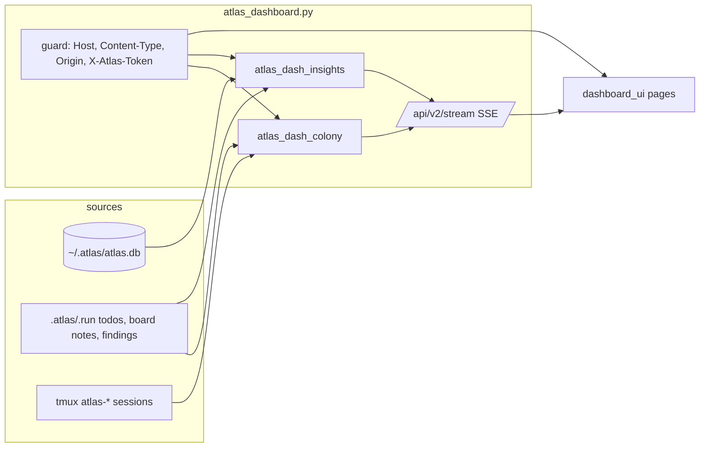

# Atlas Workboard (dashboard v2)

Last verified against the source on 2026-10-06: `plugins/atlas/scripts/atlas_dashboard.py`, `atlas_dash_colony.py`, `atlas_dash_insights.py`, and `plugins/atlas/scripts/dashboard_ui/`. Route-level detail lives in `plugins/atlas/skills/atlas-orchestrate/references/dashboard-api.md`; this page is the product overview.

## What it is

One loopback daemon (`http://127.0.0.1:7421/`, port from `ATLAS_DASHBOARD_PORT`) serves a static single-page UI and a JSON API to every concurrent coding-agent terminal. It answers four operator questions:

1. What is going on across my projects and agents right now? (Observe)
2. Who is running, who is stuck, and can I talk to them safely? (Operate)
3. Is atlas itself learning from the friction it hits? (Improve)
4. How do I scope and configure it? (Configure)

It reads the shared `~/.atlas/atlas.db`, each project's `.atlas/.run/` (todo board, board notes, findings ledger) and live tmux panes. It does not spawn processes: starting a colony is a command it prints for you to run.

## Information architecture

Hash-routed (`#/<page>`), default `#/overview`. The sidebar has four groups; a project switcher scopes every page (`all` or one project root).

| Group | Page | Question it answers | Backing routes |
|---|---|---|---|
| Observe | Overview | What needs attention? KPIs, attention feed, recent runs, trend | `GET /api/v2/overview` |
| Observe | Activity | What happened, grouped by project, kind or agent? | `GET /api/v2/activity` |
| Observe | Health | Which atlas subsystem is failing silently? | `GET /api/v2/health` |
| Operate | Colony | Which rigs and agents exist, in what state, stuck or not? | `GET /api/v2/colony`, `colony/agent`, `colony/capture`; `POST colony/send`, `kill`, `attach-command`, `spawn-help` |
| Operate | Work | What is on the durable todo board? Status chips hide done tasks by default; with `all` selected the UI works on one project while `GET /api/v2/todos` without a project returns every known board merged (items carry `project`) | `GET`/`POST /api/v2/todos` |
| Operate | IRC | What have agents and I said to each other? | `GET`/`POST /api/v2/irc` |
| Improve | Self-improvement | Which doctor findings are open, and did a fix move the metric? Five-stage loop (Observe, Mine, Propose, Apply, Remeasure): **Propose** counts doctor findings still awaiting a fix (open plus accepted-but-unapplied), **Apply** counts fixes that landed. Doctor rows carry Mark fixed / Dismiss / Won't fix / Reopen / Remeasure; `wontfix` is stored as its own status and survives a re-mine. Verification-ledger rows (`.atlas/.run/findings.json`) are read-only: each has a unique stable id, a title (falls back to the claim), a `verifiedAt`/`verified_at` time and an explicit status (`fixed`, `dismissed`, `wontfix`, `open`, `partial`, `unverified`, `refuted`, `superseded`; an unknown verdict is `unverified`, never silently `open`). A ledger entry with no timestamp shows "undated" rather than the file's mtime. **By rule** shows baseline to now with a direction-aware trend; **Remeasured improvements** shows improved / no change / regressed / pending (a remeasure with no stored baseline records one from the miner's `metric_value`); **Score trends** draws one chart per judgment on its own scale with its good direction; severity `critical`/`major` map to `fail`. Nudges come from `hookstate` (`last_run.nudge`); Lessons follow the project filter; doctor findings are attributed to a project only when the evidence's project name maps to exactly one known root | `GET /api/v2/improve` (also pushed on the `improve` stream topic); `POST improve/finding`, `improve/remeasure` |
| Configure | Projects | Which projects are tracked, pinned, hidden? | `GET /api/v2/projects`, `PUT /api/v2/prefs` |
| Configure | Settings | Theme and density, noise filters; **Behavior** knobs (including the omp extension's env flags) and a read-only **omp model roles** table from `~/.omp/agent/config.yml` (atlas-worker, atlas-verifier, atlas-mechanic, default, smol, with whether each resolves); **Ecosystem** tabs with search (plugins, MCP servers, Atlas skills/agents/output styles, hook wirings with missing-script flags, user skills/agents/hook events); **Connectors** (password inputs, never echoed) with per-server calls, error rate (calls the hooks denied are excluded) and last used from `tool_calls`, and a health word shared with the Health page; **Agents** roster (model, effort, omp model chain, 7-day and total dispatches) and the per-project override editor, whose project list hides fixture and missing directories | `/api/v2/prefs`; legacy `/api/behavior`, `/api/ecosystem`, `/api/connectors`, `POST /api/connectors/env`, `/api/agents`, `POST /api/agents`, `/api/projects?editable=1` |

Chrome that is always present: connection indicator (`Live` or `Polling every 8s`), attention badge, theme and density toggles, command palette (`Ctrl/Cmd+K`), keyboard chords (`g` then `o a h c w i s p ,`), toasts, a right-hand drawer for agent detail.

## Update model

Primary path is Server-Sent Events: every 5 s the stream re-reads `colony`, `todos`, `irc`, `health`, `improve` and emits a topic only when its content hash changed, plus a `tick`; a comment heartbeat goes out every 15 s and the browser reconnects after 3 s. If `EventSource` is missing or fails twice, the client polls every 8 s and the topbar says so. Polling is a degraded mode.

## Security posture

Loopback bind (non-loopback needs `--allow-remote`). Every route runs a guard: `Host` must be `127.0.0.1:<port>` or `localhost:<port>`; mutations need `Content-Type: application/json`; a present `Origin` must match; mutations, the stream, and transcript-like GETs need the per-daemon `X-Atlas-Token` (a fresh random token each daemon start, injected into `<meta name="atlas-token">`; `?token=` is accepted on the stream only because `EventSource` cannot set headers). No CORS preflight is honoured. See the API reference for the exact matrix.

## OpenRig-derived concepts, adapted

[OpenRig](https://openrig.dev/features) (fetched 2026-10-06) runs teams of coding agents in tmux and gives the operator an attention view. Atlas borrowed the operator-facing ideas, not the daemon: atlas has no `rig` CLI, no fleet, no queue. Each concept below names where atlas implements it.

### Colony, rigs and agents

A **colony** is the set of tmux rigs atlas can see. A **rig** is one tmux session named `atlas-<run>`; each window is one **agent** (the `lead` window is skipped). Agents with board notes or recent subagent dispatches but no window are grouped into a synthetic `board-<project>` rig so non-tmux work still shows up. The colony is **opt-in**: it is on when `ATLAS_MUX=tmux` (`_mux_enabled`); `colony/spawn-help` returns the commands to enable and spawn, and the dashboard never spawns anything itself. Source: `atlas_dash_colony.colony_snapshot`.

Rig state: `running` (every agent live), `partial`, `stopped`.

### Agent states

Inferred from evidence in this order: exit status, failure text in the pane, an interactive prompt, then activity recency.

| State | Meaning | Evidence |
|---|---|---|
| `failed` | non-zero exit, dead pane, or a failure signature in the last 25 pane lines | exit note, `pane_dead_status`, patterns for missing model, no credit, bad API key, Python traceback |
| `exited` | clean exit | `exit 0` |
| `needs_input` | an interactive prompt is on screen | `(y/n)`, "do you want to", "press enter", numbered menus, permission allow/deny, password prompts in the last 6 lines |
| `working` | activity within 45 s | tmux window activity or latest board note |
| `idle` | alive but quiet longer than 45 s | recency |
| `unknown` | no evidence at all and no pane | like OpenRig, atlas says unknown rather than guessing idle |

### Attention feed

The Overview `attention` list is the operator inbox: silent failures mined from tool calls, friction events, hook burst-breaker trips, dashboard errors, stalled transcript ingest, doctor-miner errors, plus a `blocked todos` item when a project is selected. Policy enforcement (`gate_deny`, `gate_block`) is not a failure: the Health response carries it as a separate enforcement stream (counts, top rules, per-project totals) that never feeds `attention` or the silent-failure list. Each item has a severity (`fail`, `warn`), a count, first and last time, and an action target (`health#<id>`, `work#blocked`). The topbar badge shows `N need attention` or `All clear` from the same list and refreshes (debounced) on every `health` stream event. Unlike OpenRig's attention view it does not hold agent decision requests; those are not modelled.

### Typing guard

Two guards, same intent as OpenRig's "won't type over an agent waiting at a permission prompt":

- **Server, pane delivery.** `POST /api/v2/colony/send` and `POST /api/v2/irc` first probe the pane's foreground process (`probe_pane`, fails closed). An interactive `claude`/`omp` pane is typed into: the server captures the last 30 pane lines and, if the agent is `needs_input` or the pane shows a prompt and `force` is not set, answers `409 typing_guard` (`attach to the pane and respond, or resend with force:true`); otherwise the text goes in with `tmux send-keys -l` plus Enter, wrapped in a `From:/To:` envelope. A shell, python, node or any other non-harness pane, or a pane that cannot be probed, is refused with `409 pane_not_steerable` (typed text would run as a command) and `force` does not override it. A headless `-p` mux worker never reads its terminal, so the message is queued as a board note and the response reports `delivered: "queued"`. Every send, including a refused one, is recorded on the board; an IRC post reports `ok:false` with the reason when delivery was refused. Source: `send_to_agent`, `probe_pane`.
- **Browser, keyboard.** Global shortcuts are ignored while focus is in an input, textarea, select or contenteditable.

OpenRig's per-agent typing guard that parks automatic messages in an outbox is not implemented (see table).

### Stuck diagnosis

`diagnose_stuck` flags an agent as stuck when: `needs_input` for 120 s or longer; `failed` (reason includes the exit, "inspect capture, then respawn"); or `idle` 600 s or longer while claimed todos remain open. The Colony drawer shows "This agent looks stuck" with the reason and points at the send box and the attach command. This is the on-screen analogue of OpenRig's `rig parked` and its 5-minute stalled-task alerts; atlas evaluates on each snapshot instead of running a background watchdog that pages someone.

### Onboarding

When there are no rigs the Colony page shows an empty state instead of a blank table: "The colony is off" or, when `tmux` is not installed, "tmux is not installed", with copyable commands from `colony/spawn-help` (`brew install tmux`, `export ATLAS_MUX=tmux`, the `atlas_mux.py spawn` and `status` lines) and an "I ran it, check again" button. The Work page shows "No tasks yet". `colony/attach-command` returns `tmux attach -t atlas-<run>[:<agent>]` for a one-click copy.

## OpenRig to atlas mapping

Status: **Implemented** (same idea, atlas code exists), **Adapted** (different mechanism), **Deferred** (not built; no atlas equivalent today).

| OpenRig feature | Atlas equivalent | Status |
|---|---|---|
| Live activity per agent: working, idle, needs-input, unknown | Colony agent states plus `failed` and `exited` (`infer_state`) | Adapted |
| Attention view of work waiting on you | Overview `attention` list and topbar badge from mined silent failures and blocked todos | Adapted |
| Agents ask you for decisions, with Slack buttons | none | Deferred |
| Pause messages to an agent (typing guard with held outbox) | Prompt-aware `409 typing_guard` on send, `force` override; no outbox | Adapted |
| `rig send`: type a signed message into another agent's terminal | `POST colony/send`, `POST irc` (`From:/To:` envelope, recorded as a board note; interactive panes typed, non-harness panes `409`, headless `-p` workers queued as board notes) | Implemented |
| Read any agent's screen (`rig capture`) | `GET colony/capture` (up to 2000 lines, falls back to board notes), live Terminal view in the drawer | Implemented |
| Chatrooms and broadcasts | IRC page: channels `all` and `@<agent>`, `to: all`; no per-rig room, no broadcast-to-pane | Adapted |
| Search what agents said | Activity page `q=` filter and IRC `agent=` filter over board notes; no 1000-line screen archive | Adapted |
| Find stalled tasks (`rig parked`, 5-minute daemon check) | `diagnose_stuck` on every snapshot, surfaced in the drawer | Adapted |
| Assign tasks to agents (queue with owner and handoff) | Work page: claim, assign, move, reorder on the durable todo board | Adapted |
| Timers that wake agents | none | Deferred |
| Workflows with required steps and proof sign-off | Completion gate and todo phases live in hooks; the dashboard shows `blocked` todos only | Deferred |
| Terminal UI that agents can drive | Browser UI; every action is also a JSON route and a keyboard command | Adapted |
| Watch agent terminals side by side (herdr, cmux tiles) | `colony/attach-command` for tmux; no tiled view | Deferred |
| Agent teams from one command (`rig up`) | `atlas_mux.py spawn` run by you; `colony/spawn-help` prints the steps | Adapted |
| Add, remove, shrink agents on a live team | `colony/kill` (window or session); growing is a spawn command | Adapted |
| Mixed-harness teams (Claude Code, Codex, Pi, Oh My Pi) | Agent `harness` tag: `claude`, `omp`, `other` | Adapted |
| Choose a model per agent | Agent frontmatter `model:`/`effort:`, not set from the dashboard | Deferred |
| Adopt agents already running in tmux | none (only `atlas-*` sessions are listed) | Deferred |
| Agents across machines and fleets | none (loopback only) | Deferred |
| Restore after reboot, seat handover, fork, managed compaction | none | Deferred |
| Usage limits and per-agent token use | none on the dashboard | Deferred |
| Health checks and diagnostics (`rig doctor`, `rig health`) | Health page: subsystems `hooks, mux, dashboard, db, connectors, doctor, chronicle` plus silent failures | Implemented |
| Skills, project context, knowledge that outlasts the agent | Atlas memory (`~/.atlas/memory/`), doctor findings and lessons on the Improve page | Adapted |
| Permissions per agent | Claude Code permission settings and atlas hooks; not a dashboard control | Deferred |
| Share a team as a bundle, define a team in YAML | none | Deferred |
| Slack connector | none | Deferred |
| MCP server to drive OpenRig | atlas connectors are separate MCP servers; the dashboard exposes no MCP interface | Deferred |

## Preferences and persistence

`~/.atlas/dashboard-prefs.json` (or `$ATLAS_HOME/dashboard-prefs.json`): theme, density, default project, pinned, hidden and muted projects or kinds, saved Activity views, nav order, `refresh_seconds`, and noise filters (`collapse_duplicates`, `min_severity`). `theme`, `density` and `default_project` are mirrored into browser `localStorage` for first paint. Full key table: `dashboard-api.md`.

## Where the code is

| Concern | File |
|---|---|
| HTTP layer, guard, static files, SSE, legacy routes | `plugins/atlas/scripts/atlas_dashboard.py` |
| Colony, IRC, todos | `plugins/atlas/scripts/atlas_dash_colony.py` (tests: `test_atlas_dash_colony.py`) |
| Projects, overview, health, activity, improve, prefs | `plugins/atlas/scripts/atlas_dash_insights.py` (tests: `test_atlas_dash_insights.py`) |
| Client | `plugins/atlas/scripts/dashboard_ui/` (`index.html`, `css/`, `js/app.js`, `api.js`, `components.js`, `dom.js`, `js/pages/*.js`) |
| Connector credential flow | `plugins/atlas/references/connector-config-flow.md` |
| API reference | `plugins/atlas/skills/atlas-orchestrate/references/dashboard-api.md` |
