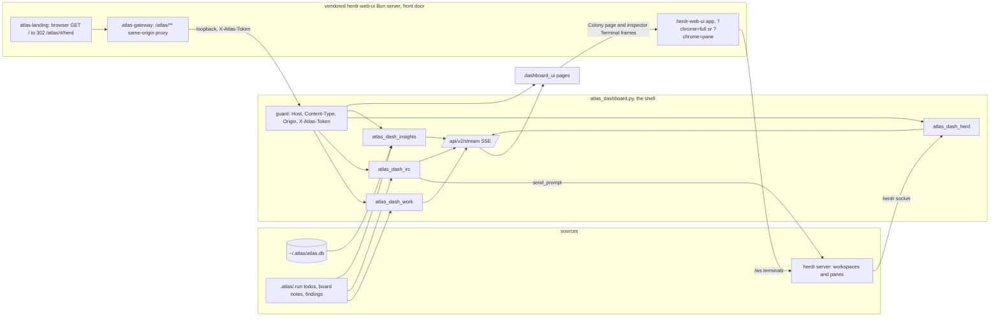

# Atlas Command Center (dashboard v2)

Last verified against the source on 2026-10-07: `plugins/atlas/scripts/atlas_dashboard.py`, `atlas_dash_work.py`, `atlas_dash_irc.py` (channel routes), `atlas_dash_herd.py` (agents and console routes), `atlas_dash_insights.py`, and `plugins/atlas/scripts/dashboard_ui/` (`js/app.js`, `js/pages/agents.js`, `channel-lens.js`, `herdr.js`, which is the Colony page). The colony itself (herdr transport, single-origin front door, root redirect, remote access) is documented in `docs/atlas-colony.md`; the channel model in `docs/atlas-channels.md`. Route-level detail lives in `plugins/atlas/scripts/dashboard_ui/design/API.md` (every route the UI calls, with response examples) and `plugins/atlas/skills/atlas-orchestrate/references/dashboard-api.md`; this page is the product overview. The product was called the Atlas Workboard before the rebuild; the file name `docs/atlas-workboard.md` is kept.

## What it is

One loopback daemon (`http://127.0.0.1:7421/`, port from `ATLAS_DASHBOARD_PORT`) serves a static single-page UI and a JSON API to every concurrent coding-agent terminal. It answers four operator questions:

1. What is going on across my projects and agents right now? (Observe)
2. Who is running, who is stuck, and can I talk to them safely? (Operate)
3. Is atlas itself learning from the friction it hits? (Improve)
4. How do I scope and configure it? (Configure)

It reads the shared `~/.atlas/atlas.db`, each project's `.atlas/.run/` (todo board, board notes, channel registry, findings ledger) and the live herdr agents (read from the herdr unix socket). Its read routes never spawn; processes start only from explicit actions: the Board lens's "Start" op (`atlas_launch.launch`), the "Start terminal service" palette action and the **Start terminal service** button of the Colony recovery card (`POST /api/v2/herd/ensure`), and the token-guarded API routes `POST /api/v2/herd/panes` and `.../panes/<pane>/kill` (no UI control calls those two). **The dashboard is the shell**: opened through the herdr-web-ui front door it is served same-origin under `/atlas/` (the front door redirects a plain browser visit of `/` to `/atlas/#/herd`, which the router redirects to `#/colony`), and the unmodified herdr UI is hosted by the Colony page and the inspector's Terminal tab (see `docs/atlas-colony.md`).

## Information architecture

Hash-routed (`#/<page>`, optional `?lens=<lens>`), default `#/overview`. The rail has four groups (Observe, Operate, Improve, Configure) and, under Operate, a live tree of herdr workspaces, tabs and agents; it collapses to a flyout. A project switcher scopes every page (`all` or one project root). Old route ids keep working as aliases that keep the query: `#/herd`, `#/herdr` and `#/console` redirect to `#/colony`, `#/work` is `agents?lens=board`, `#/irc` is `agents?lens=channel`, and `#/agents?lens=colony` (or `lens=console`) also redirects to `#/colony` (`ALIASES` and `route()` in `js/app.js`).

| Group | Page | Question it answers | Backing routes |
|---|---|---|---|
| Observe | Overview | What needs attention? KPIs, attention feed, recent runs, trend | `GET /api/v2/overview` |
| Observe | Activity | What happened, grouped by project, kind or agent? | `GET /api/v2/activity` |
| Observe | Health | Which atlas subsystem is failing silently? Each card is `measured` or not: `measured:false` means no data source exists yet, so the status is `unknown` and the card reads `Not measured: <reason>` (never an invented "never"). Last OK and Last failure are real times (`last_ok`, `last_fail`), a measured subsystem with no failure reads `None recorded in this window`, and each card has a sparkline from `history` (10 ok/fail buckets across the window) or the backend's `history_reason` where no timestamped source exists. The `hooks` card is `fail` only while the newest circuit-breaker trip (`hook_burst_tripped`) is newer than the newest successful hook run; an older trip with a later hook run is `warn` and the detail names it (`last trip <timestamp> (session <12-char id>)`); no trip is `ok`. The daemon imports this rule at start, so a running dashboard shows the change after it restarts | `GET /api/v2/health` (per subsystem `measured`, `reason`, `last_ok`, `last_fail`, `evidence[]`, `history[]`, `history_source`, `history_reason`; details in `design/API.md`) |
| Operate | Agents (route `#/agents`, one canvas, four lenses, Fleet, Board, Channel and Supervision, switched by a segmented control; the rail lists Agents and, as its own page, Colony) | Who is running, who is stuck, what are they working on? | `GET /api/v2/agents` (unified `AgentRecord` list; SSE topic `agents`), `GET /api/v2/agents/<id>/peek`, `POST /api/v2/agents/<id>/prompt` (token-guarded) |
| Operate | Agents, **Fleet** lens (default) | One card or row per agent with a state (`working`, `input` for herdr `blocked`, `idle`, `done`, `unknown`, derived `fail`), age in state, tab label, parent pane and subagents, a prompt box that only reaches idle `claude`/`omp` panes (the UI posts `POST /api/v2/herd/agents/<pane>/prompt`), and a "New workspace" button. The inspector (one `aside#inspector`, docked at wide widths, overlay otherwise, bottom sheet at 767px and below) has a Terminal tab that frames `/?pane=<id>&machine=local&chrome=pane&theme=<t>`, and an "Open in Colony" button (`#/colony?pane=<id>`). Workspace, tab and pane create, rename, close and send-keys are native (`js/herdr-actions.js`, same-origin `/api/workspace\|tab\|pane/*` on the host) and need the front-door origin: standalone they fail with a sentence naming the gateway | `GET /api/v2/agents`, `POST /api/v2/herd/agents/<pane>/prompt`, `GET /api/v2/herd/console` |
| Operate | Agents, **Board** lens (alias `#/work`) | What is on the durable todo board? Status chips hide done tasks by default; with `all` selected the UI works on one project while `GET /api/v2/todos` without a project returns every known board merged (items carry `project`). Still the earlier Work page (`js/pages/work.js`) mounted inside the lens | `GET`/`POST /api/v2/todos` |
| Operate | Agents, **Channel** lens (alias `#/irc`, chord `g n`) | What have agents and I said to each other? A native single-column lens (`js/pages/channel-lens.js`): channel name (a select only when there is more than one channel), one dim `main · lead X · branch` line, one row of member chips (click = set To, small icon = open the agent), the message log (last 100, oldest first, the only scrolling region) and one composer (`To`, a textarea, Send; Everyone posts to the channel, a member is prompted). A message to a named agent is typed into its idle herdr pane when one runs it, otherwise queued for the worker's hook (`delivery`: `queued`, `read`, `delivered`, `refused`, `undeliverable`). Members register themselves: an omp or Claude Code dispatch opens the lead's `<main>/<lead>` subchannel, and a mux or launch worker joins it (or `<main>/lead`) on its first board note, so the tree is filled without a manual join (`ATLAS_CHANNELS=off` disables this). Model and CLI: `docs/atlas-channels.md` | `GET`/`POST /api/v2/channels`, `GET /api/v2/channels/<name>`; `GET`/`POST /api/v2/irc` stay for the main channel |
| Operate | Agents, **Supervision** lens (`#/agents?lens=supervision[&channel=<lead channel>]`, chord `g u`, palette "Go to Supervision"; reached from the **Supervise** chip on a lead's Fleet card and the **Supervise** button in a lead subchannel's Channel header) and the Channel lens **Board** tab | What are a lead's subagents doing, and what is on each one's todo board? Native (`js/pages/supervision-lens.js`, rows from `MemberBoard` in `js/pages/channel-lens.js`, grouping in `memberBoard` in `js/chan-names.js`). One tree per lead subchannel `<folder>@<branch>/<lead>`: the lead row, then its subagents nested; each row shows the role chip (lead or subagent), presence (the live herdr pane state from the agents store matched by name or pane id, else the state the channel API reports, else "no pane"), todo counts (active, open, blocked, done), the in-progress item (`Now`), every todo item (first 8), the last note with its age, a **Message** button (sets the Channel composer's To) and **Open** (the agent inspector). A lead with no board items shows `no todos`; a lead with no subagents says so. The Channel lens has the same rows for the selected channel under a **Messages \| Board** switch. Data: `GET /api/v2/channels` (parent links) and `GET /api/v2/channels/<name>` `board.owners[]` (`owner, role, parent, counts, last_note, items`); a member without an owner entry renders with zero counts. The earlier native colony-lens never shipped: Colony is the herdr frame only, and supervision lives here. | `GET /api/v2/channels`, `GET /api/v2/channels/<name>` |
| Operate | **Colony** (its own page, route `#/colony[?pane=<id>]`, chord `g c`; `#/herd`, `#/herdr`, `#/console` and `#/agents?lens=colony` redirect here) | What is on the workers' terminals, and everything upstream herdr offers (new session, worktrees, files, settings, devices, voice, remote machines)? The page is only the herdr-web-ui app framed edge to edge as `?chrome=full&theme=<t>` (`pane=<id>&machine=local` when a pane is given): no page header, no lens bar and no Console/Map switch (`mountConsoleFrame` in `js/pages/herdr.js`, `consoleUrl` in `js/fleet.js`). Inside the frame the herdr host drops its own header and sidebar (`CHROME_FULL`, patched in `colony/herdr-web-ui/src/App.tsx`; a top-level visit keeps the normal UI). The frame sandbox is `allow-scripts allow-same-origin allow-forms allow-popups allow-popups-to-escape-sandbox allow-downloads` plus clipboard, microphone and fullscreen permissions. Under `/atlas/` (`<meta name="atlas-base">`) the frame uses `location.origin`; standalone it uses the web UI URL from the agents store. A recovery card replaces the frame only when a layer is down: "herdr isn't running" with **Recheck**, or "The terminal service isn't running. The agent list is live; terminals need it." with **Start terminal service** (`POST /api/v2/herd/ensure`) and **Recheck**; a "Colony is slow to load" card follows 12 s without a `load` event, and "Colony cannot open inside itself" replaces the frame when the dashboard is itself framed | `GET /api/v2/herd/agents` (`web_ui.url`), `GET /api/v2/herd/colony`, `POST /api/v2/herd/ensure`; `GET /api/v2/herd/console` (`url`, `chrome_full_url`, `herdr_ui_url`, `pane_url_template`, `reachable`, `auth_required`, `layers`) returns the same frame URLs but no dashboard page calls it |
| Improve | Self-improvement | Which doctor findings are open, and did a fix move the metric? Five-stage loop (Observe, Mine, Propose, Apply, Remeasure): **Propose** counts doctor findings still awaiting a fix (open plus accepted-but-unapplied), **Apply** counts fixes that landed. Doctor rows carry Mark fixed / Dismiss / Won't fix / Reopen / Remeasure; `wontfix` is stored as its own status and survives a re-mine. Verification-ledger rows (`.atlas/.run/findings.json`) are read-only: each has a unique stable id, a title (falls back to the claim), a `verifiedAt`/`verified_at` time and an explicit status (`fixed`, `dismissed`, `wontfix`, `open`, `partial`, `unverified`, `refuted`, `superseded`; an unknown verdict is `unverified`, never silently `open`). A ledger entry with no timestamp shows "undated" rather than the file's mtime. **By rule** shows baseline to now with a direction-aware trend; **Remeasured improvements** shows improved / no change / regressed / pending (a remeasure with no stored baseline records one from the miner's `metric_value`); **Score trends** draws one chart per judgment on its own scale with its good direction; severity `critical`/`major` map to `fail`. Nudges come from `hookstate` (`last_run.nudge`); Lessons follow the project filter; doctor findings are attributed to a project only when the evidence's project name maps to exactly one known root | `GET /api/v2/improve` (also pushed on the `improve` stream topic); `POST improve/finding`, `improve/remeasure` |
| Configure | Projects | Which projects are tracked, pinned, hidden? | `GET /api/v2/projects`, `PUT /api/v2/prefs` |
| Configure | Settings | Theme and density, noise filters; **Behavior** knobs (including the omp extension's env flags) and a read-only **omp model roles** table from `~/.omp/agent/config.yml` (atlas-worker, atlas-verifier, atlas-mechanic, default, smol, with whether each resolves); **Ecosystem** tabs with search (plugins, MCP servers, Atlas skills/agents/output styles, hook wirings with missing-script flags, user skills/agents/hook events); **Connectors** (password inputs, never echoed) with per-server calls, error rate (calls the hooks denied are excluded) and last used from `tool_calls`, and a health word shared with the Health page; **Agents** roster (model, effort, omp model chain, 7-day and total dispatches) and the per-project override editor, whose project list hides fixture and missing directories | `/api/v2/prefs`; legacy `/api/behavior`, `/api/ecosystem`, `/api/connectors`, `POST /api/connectors/env`, `/api/agents`, `POST /api/agents`, `/api/projects?editable=1` |

Chrome that is always present: connection indicator (`Live` or `Polling every 8s`), attention badge, theme and density toggles, command palette (`Ctrl/Cmd+K`), keyboard chords (`g` then `o a l h i p ,` for Overview, Agents, Activity, Health, Improve, Projects, Settings; `d` Agents, `s` Improve, `w` Board, `c` Colony, `n` Channel, `x` Colony), toasts, and the inspector. `Mod+Shift+K` belongs to the console's own palette, not Atlas's. **Mobile:** the bottom tab bar shows the first four pages of the saved nav order and a More popover lists the rest plus the project picker; the entries live in `MOBILE_TABS` in `js/nav-order.js` (moved there from `js/app.js`, which builds the bar from it in the saved order). Colony is one entry (`["colony", "Colony"]` in `MOBILE_TABS`, link `#/colony`); with the default order it sits in the More popover. **Framed mode** (`data-shell="framed"`, set by `js/theme-boot.js` when the page is inside a frame or loaded with `?embed=1`): no rail, a slim context bar, `atlas:attention {count, needInput, level}` and `atlas:title {title}` posted to the parent origin, and `atlas:theme` accepted only from `window.parent`. `select-pane` (a herdr notification click, same origin) opens `#/colony?pane=<id>`; `herdr:selected-pane` mirrors into the hash while on the Colony page and `herdr:attention` refreshes the agents store.

## Command Center UX (10.4.3)

- **Settings.** Each knob has a plain-language description and a Details panel (effect, default, harnesses reached, when it takes effect, where it is read; env-reader refs also scan `omp/*.ts`), group intros, a jump bar and a filter box. Advanced is collapsed to 25 documented user-facing vars. Shell-scope knobs (`ATLAS_HOOK_BRIDGE`, `ATLAS_BRIDGE_HOOK_TIMEOUT_S`, `ATLAS_WORKER_MAX_TOKENS`, `ATLAS_ADVISOR_GATE`, `ATLAS_HOME`, `ATLAS_DB`) are read-only with export instructions because the store cannot reach them. "Now" shows `hook_value`/`hook_source`, not the dashboard process env. Saving patches only the changed row with inline Saved/error, keeping scroll, open sections and focus.
- **Shell.** `dom.js` `patchInto` reconciles by key on refresh (keeps scroll, focus, open `
`, typed input); the topbar rebuilds only on change. A chip shows `Atlas <version> · <db> · as of HH:MM:SS` (orange "test data" on a temp DB). Nav groups: Monitor/Operate/Improve/Configure. Overview answers "Is Atlas healthy?" (same `/api/v2/health` 7d window and counts as Health), "What is running now?" and "What needs me?" (same set as the top-bar count). KPI % deltas show only when the prior value is >=10, else "prior 7 days: N".
- **Health, Improve, Activity.** Each subsystem card has what / warn means / next action, active vs historic states with ages-out dates, and warns only on recent events. The Chronicle card detects never-ingested transcripts (Claude vs omp) with backfill commands. Silent failures split "Happening now" vs "Historic, aging out". BrokenPipe/ConnectionReset are not counted as dashboard errors. Activity rows link to transcripts.
- **Daemon.** Stop waits for an lsof-killed listener to release the port (`port_still_held` otherwise); an exiting daemon clears only a pidfile naming its own pid.
- **Daemon pidfiles.** Pidfiles are per port (`dashboard-<port>.pid`) and `stop --port` targets one port; an exiting daemon clears only its own record.
- **Chronicle card.** Matches transcripts by filename id or omp header id and ignores empty, subagent/fork and scratch sessions. It says "Live ingest runs on session stop; N ended sessions were missed (a Claude, b omp)" and shows backfill commands only for genuine misses.

## Update model

Primary path is Server-Sent Events: every 5 s one shared sampler per project filter (stopped when the last client leaves) re-reads `herd` (`/api/v2/herd/agents`), `agents` (`/api/v2/agents`), `todos`, `irc`, `health`, `improve` (`SSE_TOPICS`) and emits a topic only when its content hash changed (volatile fields such as `preview`, `last_ts`, `idle_seconds` are excluded; no topic has a forced refresh today, `SSE_FORCE_REFRESH_S` is empty), plus a `tick`; a comment heartbeat goes out every 15 s and the browser reconnects after 3 s, resuming with `Last-Event-ID`. A route that fails is sent as a `route_error` event and logged. The six hot v2 GETs share a single-flight 2 s cache cleared on any v2 mutation; `improve` and `todos` are paged by default (`?full=1`, `?limit=N|all&offset=N`, `?done=N|all`, a `page` field says what was cut). If `EventSource` is missing or fails twice, the client polls every 8 s and the topbar says so. Polling is a degraded mode.

## Security posture

Loopback bind (non-loopback needs `--allow-remote`). Every route runs a guard: `Host` must be `127.0.0.1:<port>` or `localhost:<port>`; mutations need `Content-Type: application/json`; a present `Origin` must match; mutations, the stream, and transcript-like GETs need the per-daemon `X-Atlas-Token` (a fresh random token each daemon start, injected into `<meta name="atlas-token">`; `?token=` is accepted on the stream only because `EventSource` cannot set headers). No CORS preflight is honoured. See the API reference for the exact matrix. Behind the herdr-web-ui front door the browser talks to `/atlas/**` on the front door's origin and herdr-web-ui's own auth decides who gets in (the root redirect and the gateway both run after that decision); the gateway then calls this daemon as the loopback client with its own scraped token (`docs/atlas-colony.md`, Security model).

**Path-opening routes.** `POST /api/v2/open-file` and `/open-editor` act only inside a validated root: `/`, the home directory or any ancestor of it, `/tmp`, `/var`, `/private`, the OS temp dir, the system trees (`/etc /usr /bin /sbin /System /Library /Applications`), dot directories under home and roots without a `.git`, `.atlas` or `.claude-plugin` marker answer 403 `unknown_root` even when the `projects` table or an agent cwd names them; dot components and secret-looking file names below a valid root answer 403 `forbidden_path`. Detail and the remaining limit: `docs/atlas-integrations.md` "Root validation".

## OpenRig-derived concepts, adapted

[OpenRig](https://openrig.dev/features) (fetched 2026-10-06) runs teams of coding agents in tmux and gives the operator an attention view. Atlas runs its own workers in herdr panes instead (`docs/atlas-colony.md`). Atlas borrowed the operator-facing ideas, not the daemon: atlas has no `rig` CLI, no fleet, no queue. Each concept below names where atlas implements it.

### Colony, workspaces and agents

A **colony** is the set of herdr workspaces atlas created for its workers. A **workspace** is named `atlas-<run>` (`atlas_herdr.colony_label`); each worker is one tab/pane in it, labelled with the worker name. An **agent** is what herdr reports for a pane: `agent` (`claude`, `omp`, or `unknown` for a plain shell), `status`, `cwd`, workspace label and a deep link into herdr-web-ui (`atlas_herdr._agent_row`). The dashboard reads that list from the herdr socket (`GET /api/v2/herd/agents`, always HTTP 200; `herdr.reachable` says whether the socket answered) and never infers state itself. `GET /api/v2/agents` joins that list with colony workers, board todo owners and channel participants into one `AgentRecord` list (`layers` reports Atlas, the herdr socket and the herdr web UI separately). The Fleet lens renders it; the live pane list, chat and terminal come from the Colony page and the inspector's Terminal tab. Workers are spawned by `atlas_launch.launch` or `atlas_mux.py spawn`, not by the dashboard's read routes. The transport is herdr by default and tmux only when `ATLAS_COLONY_TRANSPORT=tmux` or the herdr socket does not answer (`atlas_mux.transport`); `atlas_mux.py spawn` still needs `ATLAS_MUX=tmux` as its opt-in gate. Participants with no pane appear in the Fleet only while recent (clean exit 1 h, failed exit 6 h, open task owner 6 h) and always in the Channel and Board lenses. Details and architecture: `docs/atlas-colony.md`.

### Agent states

herdr reports the state; atlas groups the `GET /api/v2/herd/agents` counts by it (`atlas_dash_herd.STATUSES`):

| State | Meaning |
|---|---|
| `working` | agent is producing output or running a tool |
| `blocked` | agent is waiting on you (a permission or input prompt) |
| `idle` | agent is alive and at its prompt; the only state that accepts a prompt from IRC or `POST /api/v2/herd/agents/<pane>/prompt` |
| `done` | agent finished |
| `unknown` | herdr reports nothing (also any status outside the four above) |

The meanings of `working`/`blocked`/`idle`/`done` are herdr's. The UI vocabulary maps `blocked` to `input` and adds a derived `fail` for a participant whose last channel line is a non-zero `exit N` (herdr has no failed state). The age in a state comes from `state_changed_at`: the daemon stamps when it first saw each `(status, state_change_seq)`; `state_changed_source` is `observed` or `first_seen` (a lower bound).

### Attention feed

The Overview `attention` list is the operator inbox: silent failures mined from tool calls, friction events, hook burst-breaker trips, dashboard errors, stalled transcript ingest, doctor-miner errors, plus a `blocked todos` item when a project is selected. Policy enforcement (`gate_deny`, `gate_block`) is not a failure: the Health response carries it as a separate enforcement stream (counts, top rules, per-project totals) that never feeds `attention` or the silent-failure list. Each item has a severity (`fail`, `warn`), a count, first and last time, and an action target (`health#<id>`, `work#blocked`). The topbar badge shows `N need attention` or `All clear` from the same list and refreshes (debounced) on every `health` stream event. Unlike OpenRig's attention view it does not hold agent decision requests; those are not modelled.

Failure attribution: `atlas_db.classify_error` sorts each tool error into `deny`, `model_misuse`, `environment`, `tool_fault`, `user_code` or `unknown`. `user_code` covers user tracebacks in eval/Bash, which are not atlas silent failures (unknown with text 26 -> 12); "Service mode does not accept" is `model_misuse`; Chroma/fallback errors are `environment`. The KPI counts only atlas-attributable classes; the Health page shows the rest in a "Tool errors by cause" card. Rows recorded before error capture fold into `tool_error_legacy` and are not counted. Gates arm only in project directories (`scripts/atlas_scope.py`, mirrored by `gates_armed` in `omp/scope.ts`); set `ATLAS_GATES=always` to arm everywhere or `ATLAS_GATES=off` to disarm. Hook crashes are recorded in `~/.atlas/hook-faults.jsonl` and shown as `hook_crash`.

**Scope rule (`scripts/atlas_scope.py`, `gates_armed(cwd)`).** A directory is armed when it, or an ancestor below `$HOME`, holds a project marker (`.git`, `.claude`, `package.json`, `pyproject.toml`, `Cargo.toml`, `go.mod`, `CLAUDE.md`, `AGENTS.md`; `omp/scope.ts` keeps an identical list, enforced by `hooks/test_atlas_contract.py`). Scratch roots (`/tmp`, `/private/tmp`, `/var/folders`, `/private/var/folders`) and `$HOME` itself are never armed. A marker-less directory is still armed when the atlas DB (`ATLAS_DB`, default `~/.atlas/atlas.db`) has a project row with that `root_path` and at least one dispatch ever (read-only lookup; any DB error reads as no history). `ATLAS_GATES=always` forces armed, `ATLAS_GATES=off` forces unarmed; any internal error fails toward armed. Unarmed directories skip the recall gate and the lean-ctx routing denies, but the dispatch tripwire still logs dispatches and the nested-dispatch deny (a subagent may not dispatch) always applies.

**Hook fault log (`scripts/atlas_faults.py`).** Fail-open hook handlers call `record(hook, exc, cwd=None)`, which appends one JSON line to `~/.atlas/hook-faults.jsonl` (`$ATLAS_HOME/hook-faults.jsonl` when set) with fields `ts` (epoch seconds), `hook`, `error` (capped at 500 chars), `type` (exception class name) and `cwd`. `load(since=0.0)` returns records with `ts >= since`, oldest first, skipping malformed lines. Both are best-effort and never raise. When the file exceeds 1 MiB it is truncated to its newest half (partial leading line dropped). The dashboard surfaces these as the `hook_crash` kind.

**Test isolation (`scripts/_test_isolation.py`).** Every test module must import it first (before any atlas module). It creates a tempdir and redirects `ATLAS_HOME`, `ATLAS_DB`, `ATLAS_DASHBOARD_DB` and `ATLAS_HOOKSTATE_DIR` into it (`HOME` is left alone), removes it at exit, and is idempotent across modules and child processes. The contract test enforces that every test module imports it.

**Error backfill (`session_ingest.py --backfill-errors [root ...]`).** Re-reads surviving claude (`~/.claude/projects`) and omp (`~/.omp/agent/sessions`) transcripts and, for `tool_calls` rows with `is_error=1` and an empty `error_snippet`, fills `error_snippet` and `denied` through the same `atlas_db.update_tool_result` path as live ingest, keyed by `tool_use_id`. It is idempotent: a filled row leaves the target set, so a rerun changes nothing. Rows whose transcript is gone (or whose result text is empty) stay unknown and keep showing as `tool_error_legacy`.

### Typing guard

Two guards, same intent as OpenRig's "won't type over an agent waiting at a permission prompt":

- **Server, prompt delivery.** `POST /api/v2/herd/agents/<pane>/prompt` and `POST /api/v2/irc` hand text to a pane only through `atlas_herdr.send_prompt`: the pane id must be in the live herdr agent list (404 otherwise), the agent must be `idle` (409 `agent is not idle` for `working`, `blocked`, `done` or `unknown`), text is required and capped at 8000 characters, and nothing goes through a shell (a socket `agent.prompt` call). IRC additionally refuses a pane whose herdr `agent` is not `claude` or `omp` (`409 pane_not_steerable`, stamped `refused`, never typed, because typed text in a shell would run as a command) and wraps the text as `From: <sender> | To: <to> | <text>` with control characters collapsed to spaces (`atlas_dash_irc._deliver`, `sanitize_keys`). A busy or unreachable herdr types nothing and stamps nothing: the note stays queued for the worker's hook and the response says `agent_busy` (409) or `herdr_refused`. The earlier `typing_guard`/`input_pending`/`force` overrides and `probe_pane` are gone; the idle-only rule replaces them.
- **Browser, keyboard.** Global shortcuts are ignored while focus is in an input, textarea, select or contenteditable.

**Mailbox delivery.** Every board note carries a board-wide monotonic `seq` stamped under the notes lock; the worker hook cursor is `{ts, seq}` and a note already `delivered` or `refused` is not injected again. A message to a named agent is tracked as `queued`, `read`, `delivered`, `refused` or `undeliverable` (nothing drained it for `QUEUED_TTL_S` = 900 s). `GET /api/v2/irc` pages oldest-first with `since` and returns `more`. A killed worker (`atlas_mux kill`, SIGTERM/SIGHUP/SIGINT) leaves `exit 137`; on the herdr transport `atlas_mux kill` closes the run's workspace and writes `exit 137 [failed: killed by atlas_mux kill]` for any worker that has no exit note of its own.

**Connectors and health.** A connector reads as configured only when one `CONNECTOR_AUTH` credential alternative is fully present (the dashboard also counts `~/.config/atlas/atlas.env`); Settings' test launches the real `.mcp.json` command and calls `<vendor>_status`. Secret files (`settings.json`, the plugin `.env`) are written atomically at 0600. The doctor adds behavioural checks (`hook-faults`, `gates-armed`, `omp-bridge`, `db-writable`, `db-recent-writes`, `enforcement-rates`); the verdict counts only FAIL, so enforcement that never denies is not HEALTHY. `atlas_doctor.py --purge-tmp-sessions [--apply]` removes temp-dir sessions (dry run by default). The doctor honours `ATLAS_HOME`.

**Settings loading.** `js/pages/settings.js` `load()` returns `{ok: true}` at once and fetches the six page sections (behavior, ecosystem, connectors, prefs, projects, editable projects) independently through `loadSection`, redrawing as data lands; each section shows its own "Loading…" or error card. A section that has not answered after 15 s (`SECTION_TIMEOUT_MS`) becomes an error with code `timed_out` ("<name> did not answer within 15s.") instead of an endless skeleton, and every error card has a **Retry** button. The button is rendered per section but its handler (`reloadAll`) re-fetches all six sections.

**Daemon isolation (10.4.3).** Before, a temp-HOME caller could kill the live :7421 daemon and replace it with one serving a temp DB, so Settings/Behavior/Integrations showed only defaults and temp paths. Now `ensure`/`serve` refuse a temp env on the shared port 7421 (error `temp_env_on_shared_port`); a healthy daemon on a different DB is never replaced (`port_held_by_other_db`); `stop_daemon` kills only its own pidfile pid or a same-DB listener; `session_boot` skips under a temp HOME.

**Durable settings store (10.4.3).** atlas owns `<ATLAS_HOME or ~/.atlas>/settings.json` (`{env, changed}`, atomic, 0600; separate from Claude's `settings.json`). `POST /api/behavior` writes it plus Claude `settings.json` `env`, and the omp hook bridge exports the store into hook env, so knobs reach omp sessions. Each knob and `ATLAS_*` var shows its value, source (precedence: process > store > claude settings > default), reached harnesses, default, ref and last-changed. Advanced vars are editable. Settings survive a daemon restart (tested).

**Integrations and Agents pages (10.4.3).** Integrations lists the atlas MCP connectors with health, configured state and missing env var names (never secret values). `/api/agents` without `project_id` returns the plugin roster, and the Agents page shows it when no projects are registered.

**Durable transcripts (10.4.3).** omp used to ingest temp conversion copies (492 rows under `/var/folders/atlas-ingest-*`) that were then deleted. Ingest now records the original `~/.omp/agent/sessions` file (`ATLAS_SOURCE_TRANSCRIPT`). Endpoints: `/api/sessions/<id>/transcript` and `/api/v2/<id>/transcript`. Repair CLI: `session_ingest.py --repair-tmp-paths [--apply]` re-points recorded temp paths (481 of 492 were re-pointable); without `--apply` it is a dry run.

**Live omp ingest misses (10.4.3).** Root cause: the temp-dir leak guard in `hooks/ingest_session.py` refused every omp conversion (`atlas-ingest-*` in the OS temp dir). It now honours `ATLAS_SOURCE_TRANSCRIPT` when the source is a real non-temp file. Installed 10.4.2 keeps missing them until 10.4.3 ships; 41 omp + 2 Claude sessions need `session_ingest.py --backfill-agent omp` / `--backfill` once.

**Write guard (10.4.3).** `dispatch_tripwire` denies a write whose content is only small device-argument JSON (`pattern`/`path`/`queries`/...) over an existing repo file, `.json` files included ("looks like device arguments written over <file>"); new files and real JSON edits pass. Added after three accidental overwrites in one session.

**Metrics truthfulness (10.4.3).** Zero-predictive-validity `turn_quality` judgments emit no findings or regressions (findings 22 -> 16). Temp-path sessions are excluded from facet and friction metrics (sessions missing facets 489 -> 50 real). `recurring_friction` is per 100 real sessions (gate_block 100 raw -> 56.8/100). `typesafe_client` uses the certifi bundle when importable. Improvement baselines carry their unit (`scripts/atlas_doctor.py` `METRIC_UNITS`/`_supersede_stale_units`, `scripts/atlas_selffix.py` `rebaseline_units`, dashboard Remeasure): a baseline in another unit (legacy raw `recurring_friction` counts) is never compared with the per-100-sessions value; a pending row is marked `superseded` and a fresh unit-tagged baseline recorded (improvements 49, 50, 85, 86 re-baselined, no false verdict written). Selffix baselines are stored as `{v, unit}`.

**Verification record.** The 10.2.0 Command Center / channels / herdr host / integrations wave was checked twice by `atlas:verifier`, recorded in `.atlas/.run/findings.json`: `command-center-integrations-10.2.0-verified` (status `partial`: the verifier found a second herdr-web-ui stack spawned at session boot, a root check made void by hostile `projects` rows, stale hooks tests, 58/60 and 59/60 sweeps, a theme check that passed with `dark->dark`) and, after the fixes, `command-center-integrations-10.2.0-reverified` (status `verified`: hooks 1169 OK, scripts 1469 passed, omp 353 pass, one stack, root guard 403s, sweep 60/60 with deep 10/10 on two of three runs, the first run's deep checks 6/10 at machine load 69 attributed to timing). The fixes' own entry, `command-center-integrations-10.2.0-fixes`, stays `needs-evidence` (implementer-run). Evidence: `.atlas/.run/evidence/` (`sweep`, `suites`, `hygiene`, `nav`, `scorecard`). The sweep harness `.atlas/.run/evidence/sweep/run.mjs` now fails the theme deep check unless `data-theme`, the computed body background and the saved pref all change after the `#toggle-theme` click (it previously passed on the stored pref alone).

OpenRig's per-agent typing guard that parks automatic messages in an outbox is not implemented (see table).

### Stuck diagnosis

The dashboard no longer computes a per-agent "looks stuck" verdict (the earlier `diagnose_stuck` is gone with the tmux snapshot). What remains: herdr's `blocked` state, shown as `input` on every agent card and counted in the attention badge, and the Health page's `mux` subsystem ("Colony / mux"), which warns on `agent_stuck` events mined from the atlas DB (worker runs started over an hour ago that never ended, `atlas_dash_insights.py`). This is the nearest analogue of OpenRig's `rig parked` and its 5-minute stalled-task alerts; there is no background watchdog that pages anyone.

### Onboarding

When herdr is not running the Fleet and the Colony page show a "herdr isn't running" state with a Recheck button (Atlas cannot start herdr). When herdr runs but the colony web UI does not, the Colony page shows "The terminal service isn't running" with a **Start terminal service** button that calls `POST /api/v2/herd/ensure`, and a Recheck button. The Board lens shows "No tasks yet". Install, pin and troubleshooting are in `docs/atlas-colony.md`.

## OpenRig to atlas mapping

Status: **Implemented** (same idea, atlas code exists), **Adapted** (different mechanism), **Deferred** (not built; no atlas equivalent today).

| OpenRig feature | Atlas equivalent | Status |
|---|---|---|
| Live activity per agent: working, idle, needs-input, unknown | Fleet lens: herdr's `working`, `blocked` (shown as `input`), `idle`, `done`, `unknown` read from the herdr socket (`atlas_herdr.agents`) | Adapted |
| Attention view of work waiting on you | Overview `attention` list and topbar badge from mined silent failures and blocked todos | Adapted |
| Agents ask you for decisions, with Slack buttons | none | Deferred |
| Pause messages to an agent (typing guard with held outbox) | Idle-only prompt delivery (`409 agent is not idle`), non-harness panes refused; an undelivered message stays queued on the board for the worker's hook; no outbox | Adapted |
| `rig send`: type a signed message into another agent's terminal | `POST /api/v2/herd/agents/<pane>/prompt`, `POST /api/v2/irc` (`From:/To:` envelope, recorded as a board note; idle `claude`/`omp` panes typed via `atlas_herdr.send_prompt`, non-harness panes `409`, otherwise queued for the worker's hook) | Implemented |
| Read any agent's screen (`rig capture`) | The inspector's Terminal tab or the Colony page (`/ws`); `GET /api/v2/agents/<id>/peek` (bounded, ANSI-stripped, secrets masked, token-guarded) exists but no page calls it yet | Adapted |
| Chatrooms and broadcasts | Channel lens: one main channel per `<folder>@<branch>` plus a subchannel per lead (`docs/atlas-channels.md`); `to: all` reaches the whole channel; no broadcast-to-pane | Adapted |
| Search what agents said | Activity page `q=` filter and IRC `agent=` filter over board notes; no 1000-line screen archive | Adapted |
| Find stalled tasks (`rig parked`, 5-minute daemon check) | herdr's `blocked` state per agent (`input`); Health `mux` subsystem warns on worker runs open over an hour | Adapted |
| Assign tasks to agents (queue with owner and handoff) | Board lens: claim, assign, move, reorder on the durable todo board | Adapted |
| Timers that wake agents | none | Deferred |
| Workflows with required steps and proof sign-off | Completion gate and todo phases live in hooks; the dashboard shows `blocked` todos only | Deferred |
| Terminal UI that agents can drive | Browser UI; every action is also a JSON route and a keyboard command | Adapted |
| Watch agent terminals side by side (herdr, cmux tiles) | The Atlas dashboard is the shell; the Colony page hosts the full herdr UI (`?chrome=full`) and the inspector frames one pane (`?chrome=pane`); the front door serves the dashboard same-origin under `/atlas/` and redirects a browser visit of `/` there | Implemented |
| Agent teams from one command (`rig up`) | `atlas_mux.py spawn` or `atlas_launch.launch` (panes of the herdr workspace `atlas-<run>`); `POST /api/v2/herd/panes` opens one worker | Adapted |
| Add, remove, shrink agents on a live team | `POST /api/v2/herd/panes/<pane>/kill` (colony panes only), `atlas_mux.py kill` (whole run); growing is a spawn | Adapted |
| Mixed-harness teams (Claude Code, Codex, Pi, Oh My Pi) | Agent `harness` tag: `claude`, `omp`, `other` | Adapted |
| Choose a model per agent | Agent frontmatter `model:`/`effort:`, not set from the dashboard | Deferred |
| Adopt agents already running in tmux | none (the Fleet lens lists every herdr agent, but only `atlas-*` workspaces are managed: `list_panes`, `close_pane`) | Deferred |
| Agents across machines and fleets | One herdr per machine; reach it from a phone or another tailnet device through `tailscale serve` (`atlas_remote.py`, `docs/atlas-colony.md`); no fleet view | Adapted |
| Restore after reboot, seat handover, fork, managed compaction | none | Deferred |
| Usage limits and per-agent token use | none on the dashboard | Deferred |
| Health checks and diagnostics (`rig doctor`, `rig health`) | Health page: subsystems `hooks, mux, dashboard, db, connectors, doctor, chronicle` plus silent failures | Implemented |
| Skills, project context, knowledge that outlasts the agent | Atlas memory (`~/.atlas/memory/`), doctor findings and lessons on the Improve page | Adapted |
| Permissions per agent | Claude Code permission settings and atlas hooks; not a dashboard control | Deferred |
| Share a team as a bundle, define a team in YAML | none | Deferred |
| Slack connector | none | Deferred |
| MCP server to drive OpenRig | atlas connectors are separate MCP servers; the dashboard exposes no MCP interface | Deferred |

## Preferences and persistence

`~/.atlas/dashboard-prefs.json` (or `$ATLAS_HOME/dashboard-prefs.json`): theme, density, default project, pinned, hidden and muted projects or kinds, saved Activity views, nav order, `refresh_seconds`, and noise filters (`collapse_duplicates`, `min_severity`). Behavior knobs are stored separately in `settings.json` (see "Durable settings store"). `theme`, `density` and `default_project` are mirrored into browser `localStorage` for first paint. Full key table: `dashboard-api.md`.

## Layout invariant

The shell is fixed to the viewport (`.app` `height: 100vh`); only `.main` and the inner board columns scroll. Absolutely positioned boxes need a positioned ancestor or explicit offsets: `.sr-only` in `css/base.css` sets `top: 0; left: 0`. Without them, a hidden label deep in a list escapes `.main`'s `overflow: auto` and stretches the page scroll. Before 2026-10-06 that produced a 6772px document on the Work page in a 900px window.

## Where the code is

| Concern | File |
|---|---|
| HTTP layer, guard, static files, SSE, legacy routes | `plugins/atlas/scripts/atlas_dashboard.py` |
| Todos | `plugins/atlas/scripts/atlas_dash_work.py` (tests: `test_atlas_dash_work.py`) |
| IRC (board notes, delivery stamps) | `plugins/atlas/scripts/atlas_dash_irc.py` (tests: `test_atlas_dash_irc.py`) |
| Projects, overview, health, activity, improve, prefs | `plugins/atlas/scripts/atlas_dash_insights.py` (tests: `test_atlas_dash_insights.py`) |
| Agents, Colony, Channel, herdr socket client | `plugins/atlas/scripts/atlas_dash_herd.py` (agents, peek, prompt, console routes), `atlas_dash_irc.py` (channel routes), `atlas_herdr.py` (guard, CLI, panes; tests: `test_atlas_herdr.py`), `dashboard_ui/js/pages/agents.js`, `channel-lens.js`, `herdr.js` (the Colony page) |
| Herdr tooling, tode, cmux browser (integrations routes, Settings Integrations, Projects "Herdr projects", path:line links) | `plugins/atlas/scripts/atlas_dash_integrations.py` (routes), `atlas_integrations.py` (logic), `dashboard_ui/js/integrations.js`, `js/hp.js`; documented in `docs/atlas-integrations.md` |
| Front door, `/atlas/**` gateway, root redirect, remote access, architecture | `docs/atlas-colony.md` (`plugins/atlas/colony/herdr-web-ui/server/atlas-gateway.ts`, `plugins/atlas/colony/herdr-web-ui/server/atlas-landing.ts`, `plugins/atlas/scripts/atlas_remote.py`) |
| Client | `plugins/atlas/scripts/dashboard_ui/` (`index.html`, `css/`, `js/app.js`, `api.js`, `components.js`, `dom.js`, `js/pages/*.js`) |
| Connector credential flow | `plugins/atlas/references/connector-config-flow.md` |
| API reference | `plugins/atlas/skills/atlas-orchestrate/references/dashboard-api.md` |
